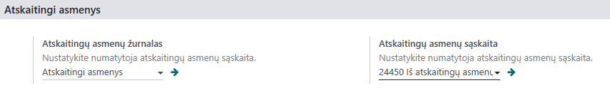

===================
Accountable Persons
===================

1. Introduction
---------------
This instruction explains how to correctly register transactions related to accountable persons.

2. Installation and Configuration
---------------------------------
Before starting to work with transactions involving accountable persons, check the settings:
Settings -> Accountable Persons

Assign an accountable persons journal and an account. Regardless of how many accountable persons there are, all entries are recorded in one general ledger account.

3. Daily Usage Scenarios
------------------------
When an accountable person pays an invoice:

- Find and open the required invoice and click "Register Payment".
  
  .. image:: accountable_persons/number2.jpg
     :alt: Invoice payment registration

A new window opens where you need to:

- Choose the journal for accountable persons
- Select manual payment method
- Choose the employee who made the payment
- Enter the amount paid
- Specify the invoice date, which is the date of payment (check)
- Optionally specify which invoice is being paid

  .. image:: accountable_persons/number3.jpg
     :alt: Payment details entry

Click "Create Payment". All payments can be viewed under Clients (or Suppliers) -> Payments, after removing filters.

Issuing cash to an accountable person from the cash register:

- At the suppliers/clients payment list, click "New".

  .. image:: accountable_persons/number4.jpg
     :alt: Issuing cash from the cash register

A new window opens where you specify:

- Payment type: Send (when issuing from the cash register) or Receive (when depositing into the cash register)
- Employee to whom the cash is issued
- Amount issued
- Date of cash issuance
- KIO/KPO number, which is automatically assigned (ensure the sequence is set in Accounting -> Configuration -> Sequences)
- Who is responsible for the cash operations
- Purpose of the cash issuance

  .. image:: accountable_persons/number5.jpg
     :alt: Cash issuance details

Check account correspondences by clicking "Journal Entry". If all is well, confirm the transaction.

Depositing cash into the cash register:

- Navigate to Clients -> Payments -> New.

  .. image:: accountable_persons/number6.jpg
     :alt: Depositing cash into the cash register

Specify:

- Payment type: Receive
- Employee who is depositing the cash
- Amount being deposited
- Date of deposit
- Automatically assigned KIO/KPO number (verify the sequence setting)
- Purpose of the deposit

  .. image:: accountable_persons/number7.jpg
     :alt: Cash deposit details

Bank transfer to an accountable person:

- Typically, bank statements are imported or synchronized, showing the transfer operation.

  .. image:: accountable_persons/number8.jpg
     :alt: Viewing bank transfer operations

- If the wrong GL account is selected, adjust via Manual Adjustment -> Specify the correct GL account.

Click Confirm.

5. Reports and Documentation
-----------------------------
For the selected period, you can print the accountable person's Advance Report:

  .. image:: accountable_persons/number9.jpg
     :alt: Advance report generation options
  .. image:: accountable_persons/number10.jpg
     :alt: Additional instructions and resources

- Date range: Select the period for the report
- Employee: Choose who the report is for
- Number: Assign a number for the report

Print the advance report.

6. Integrations and Connection with Other Modules
------------------------------------------------
How this module integrates with other Odoo modules or external systems.
Special integration instructions if needed.

7. Troubleshooting and FAQ
--------------------------
Frequent problems and their solutions.
Answers to frequently asked questions about this module.

8. Updates and Version Management
---------------------------------
How to update the module.
Version management practices.

9. Appendices
-------------
Screenshots and visual instructions.
Useful links and additional resources.