GPAIS
=====

1. Module Purpose and Operation
-------------------------------
The "GPAIS" module, published via Laurea, is designed for registering, automatically collecting records in the Odoo system, and using a VVS interface or file format to transfer data to the Unified System of Products, Packaging, and Waste Accounting (GPAIS).

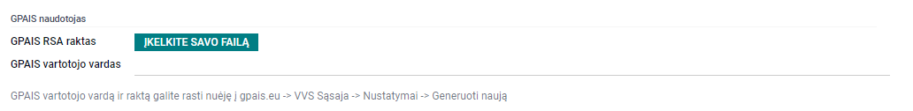

2. Module Settings
------------------
2.1 User (Representative) Settings
An Odoo system user can use the GPAIS module and export data directly to Odoo when:
   - Appropriate rights are granted:
     Settings → Users → Access Rights → Select "Manager" for GPAIS rights.

   - The user's GPAIS RSA key is uploaded, and the GPAIS username is entered. Data is uploaded in the user profile settings.

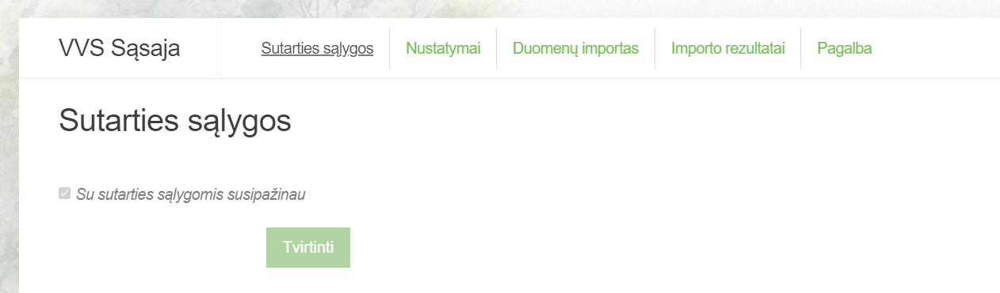

The RSA key and GPAIS username from GPAIS are obtained as follows:
   - First, contract terms are confirmed upon connecting to the GPAIS system via the VVS interface.
   
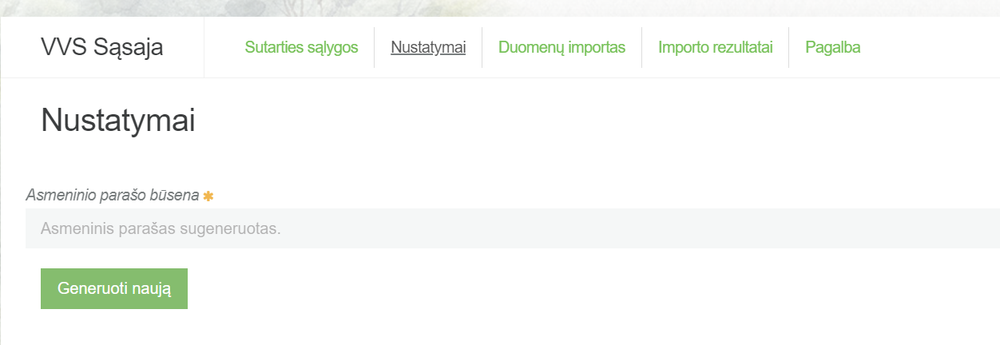

   - Then, "Generate New" is clicked in the adjacent "Settings" tab:
   
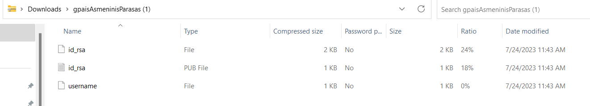

   - The generated files include: RSA key ("id_rsa") and username ("username").

2.2 Flow Registration Settings
The GPAIS flow registration ID number must be specified in Odoo. The process includes:
   - Settings → Inventory → GPAIS Settings → Select relevant flows, enter flow ID numbers, and save.

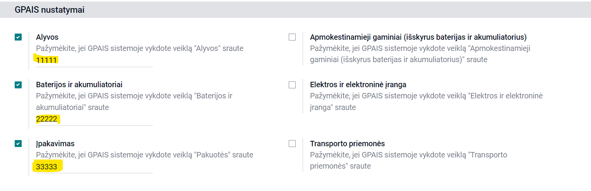

Flow ID numbers are located in the GPAIS account:
   - Accessed by clicking on one's name → VVS interface → Help → List of flow registrations for represented entities → Codes for respective flows are copied from the sent file.

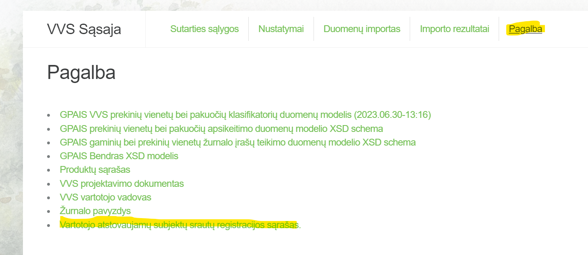

2.3 Mode Settings
Important! It is always recommended to set to test mode in both testing and production environments during the testing, journals, and GPAIS units preparation stage. Test mode should only be turned off when exporting data to the GPAIS operational environment to avoid accidental data transfer to the production GPAIS system. Test mode is enabled and disabled in the Odoo GPAIS settings.

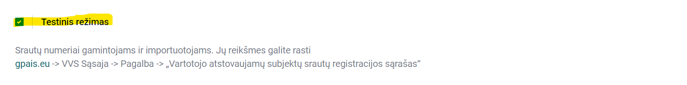

2.4 Product (Unit) Settings
Every product entering the GPAIS product list must be marked with a "GPAIS product" checkbox.

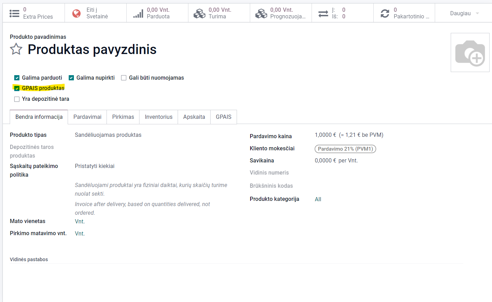

Important! Only after marking the products with the "GPAIS product" checkbox, these products will automatically start to be included in the intermediate GPAIS journal entries list. This means that if product A is marked as a GPAIS product on 02.01, the intermediate journal entries for this product will start to be automatically accumulated from this date. When forming the journal for the period from 01.01 to 03.31, and to include entries for product A for the entire period, new intermediate journal entries must be generated.

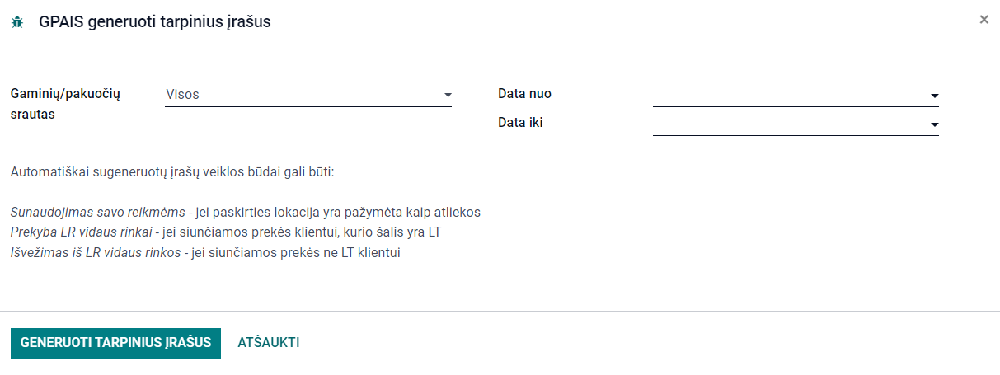

2.5 Classifier Settings
It is recommended to activate only the relevant classifiers in the "Classifications" tab of the GPAIS module. This provides a shorter list of classifiers and reduces the risk of selecting an incorrect classifier.

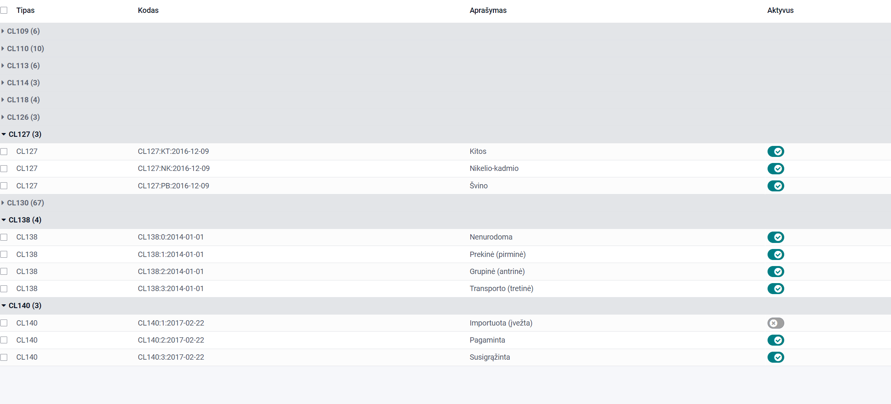

3. Product (Unit) Packaging Description
--------------------------------------
3.1 Basic Product Data
For "GPAIS products," the product (unit) information to be presented to GPAIS is specified in the "GPAIS" tab:

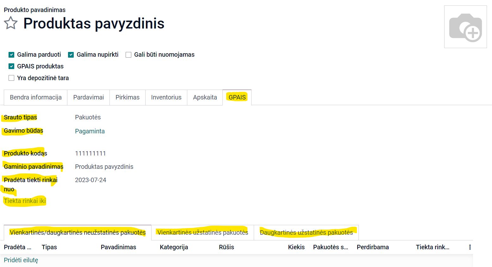

3.2 Deposit Packaging
In the case of declaring deposit packaging, such packaging codes and names are filled in the "Deposit Packaging Codes" tab:

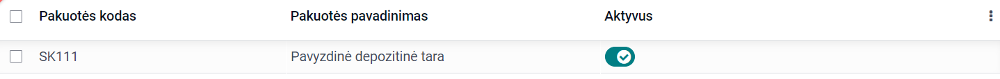

Then, when filling out the product (unit) card, the required deposit packaging is selected from the list:

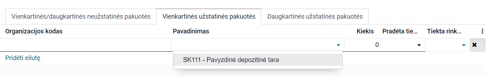

3.3 Declaring Odoo Packaging as a Separate Unit
Odoo's packaging functionality allows products to be bought and sold in packages (illustration below: one avocado and its packaging - a pallet with n units of avocados).
Using Odoo's packaging functionality, such a package can be described as a separate GPAIS unit and declared in a separate journal entry. In this case, information about the Odoo package is filled in the "Packaging" tab of the GPAIS module and assigned to the corresponding product.

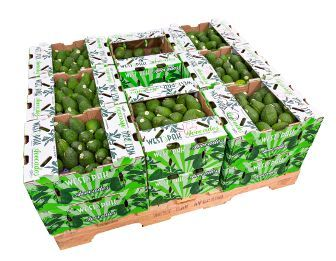

4. Data Formation and Export to GPAIS
------------------------------------
4.1 Exporting Units
Units are exported to GPAIS using the “Action” button from the product list by selecting several products/packages or directly from the product/package card by pressing the "Export to GPAIS" button:

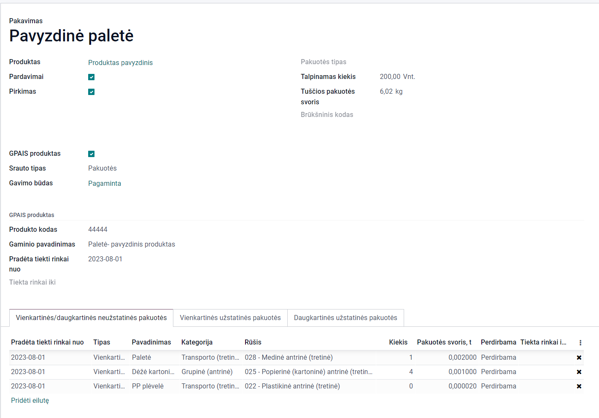

4.2 Forming and Exporting Journal Entries
After selecting the "GPAIS Journals" tab, a new journal is created, and the data for the reportable period are filled in:
   - By pressing the "Save" button, a new journal is created, and data about warehouse movements (goods dispatched to customers, write-offs) are automatically collected into the intermediate entries tab. The intermediate entries for the reportable period are summed into journal entries by marking the "Sum entries" checkbox, specifying the date of entry summation, and then pressing the "Generate Journal Entries" button.

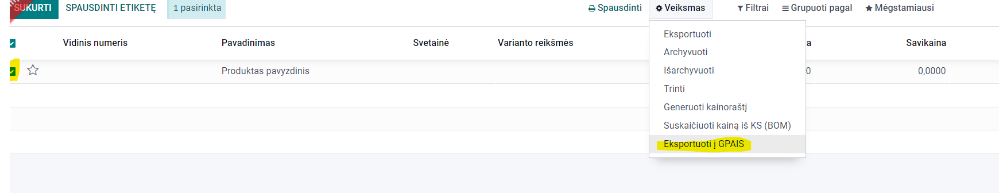

After verifying the summed journal entries and, if necessary, making adjustments, the journal entries can be exported to GPAIS. This action is performed by pressing the "Submit to GPAIS" button. Journal entries can also be uploaded to GPAIS in XML file format: press the "Generate XML Declaration File" button, and then the generated file can be uploaded to the GPAIS system.

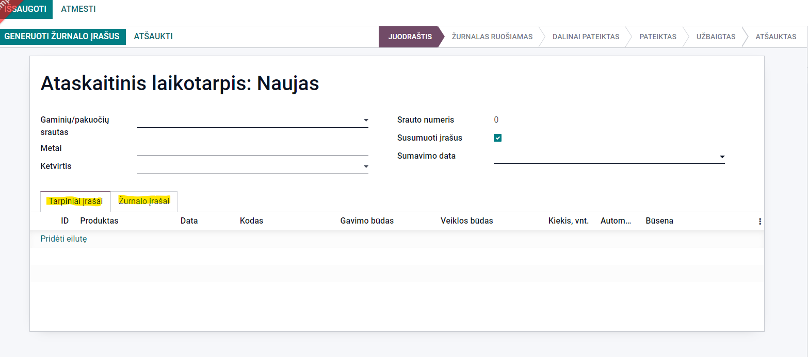

Important! Before confirming the imported journal report in the GPAIS system, it is necessary to recheck the imported data in the GPAIS system itself.

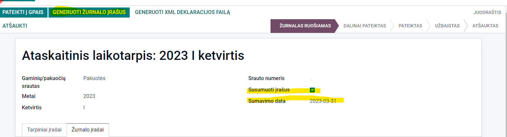
