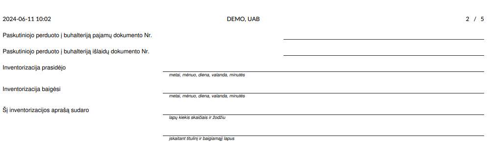

Fixed assets inventory act
==========================

Introduction
------------

You can find the fixed asset inventory act in the reports section of the Accounting module:

Daily Use Scenarios
-------------------

When selecting the print act, enter the inventory and accounting dates in the opened window, manually write the basis for performing the inventory, choose the closing date, the chairman of the commission, and commission members, the materially responsible person, and the accountant. Click the "Print" button, and a document with corresponding additional document pages ("covers") will be generated.

.. image:: fixed_assets_inventory_act/img03.jpg
    :alt: Basis for performing the inventory

