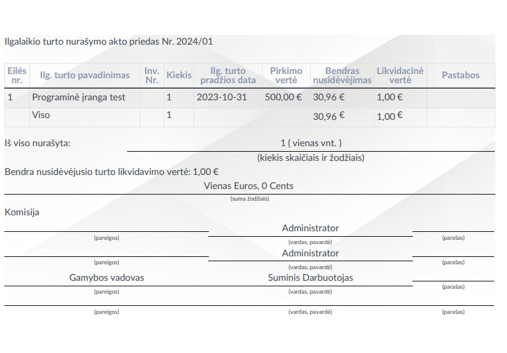

Fixed assets reports
====================

Introduction
------------

UAB Via Laurea has developed special fixed asset reports for the Lithuanian market, which can be found in the reports section of the Accounting module:

.. image:: fixed_assets_reports/img01.jpg
    :alt: Accounting module reports section

By selecting this section and Via Laurea fixed asset reports, you can choose the Asset Card, Commissioning Act, and Write-off Act in the opened window:

Daily Use Scenarios
-------------------

### Asset Card

To print the asset card, select the required report, choose the specific asset from the asset list, and set the date for which the card will be generated.

Choose the format in which you want to generate the card. An asset card with all data related to the selected asset will be generated for you.

Important: You can select not just one asset but several. In this case, a single file with cards for all selected assets will be generated at once.

### Commissioning Act

The commissioning act is prepared when the asset starts being used in the company's activities. To print it, enter the act number in the opened window, select the specific asset from the list, set the date, and enter the order number. Assign the materially responsible person. Choose the chairman of the commission and commission members from the list.

After filling in all fields, choose the document format in which you want to generate the report. Data about the asset itself is uploaded to the printed document from the asset card.

Important: As with the previous forms, if you select several assets at once, commissioning acts will be generated for the selected units at once.

### Write-off Act

The write-off act is used to generate a document for writing off an asset. Select the appropriate asset report from the list, enter the act number, document and decommissioning dates, choose the chairman and members of the commission. In the decommissioning and commission proposal sections, you can enter the necessary text to be displayed in the document. Generate the document in the required format.

The corresponding document is generated:

.. image:: fixed_assets_reports/img08.jpg
    :alt: Generated document

Important: If you select several assets in this printing form, separate documents will not be generated for each, but a single document will be formed, listing all the written-off units in an attached table.