Fuel Registration by Car
========================

1. Introduction
----------------

This module is designed to manage vehicle fleets, conduct fuel accounting, and monitor and analyze other expenses related to vehicles. 
It contributes to compliance with Lithuanian accounting standards in the Odoo system.

2. Installation and Configuration
----------------------------------

**Installation Instructions:** Necessary steps for installing the module.

**Initial Configuration:** Before using this module, specific settings need to be configured. Go to "Vehicle Park" -> Configuration -> Settings:

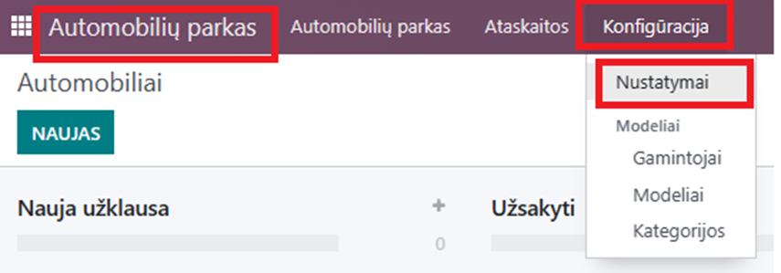

Open configuration fields:

- Specify the debit/credit fuel account.
- Choose the fuel products.
- Fuel journal: Either use the standard "various operations" or create a specialized one specifically for fuel accounting (for how to create a journal, see the "Starting with Odoo" instructions).

3. Main Features
----------------

Create a vehicle card and enter all necessary information:

- Click "New":

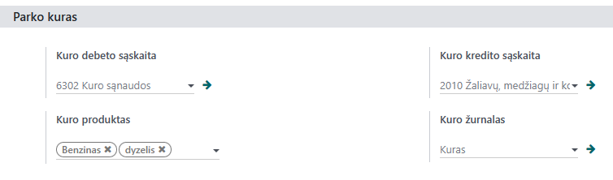

- Select a template (vehicle make) from the provided list.
- Enter the registration number.
- If needed, input information about the driver.
- Fill in the relevant fields about the vehicle.
- Fill in the required information in the tax information field.
- Specify the debit/credit account for fuel accounting.

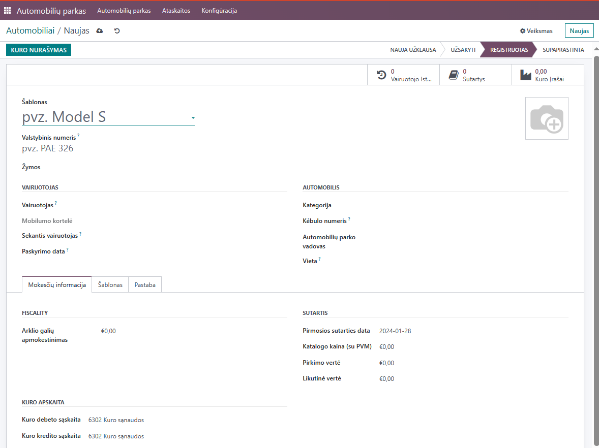

After filling in the tax information, proceed to input additional vehicle details:

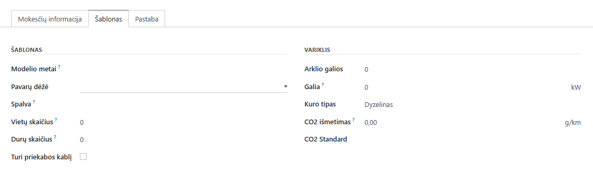

Once the vehicle card is completed and filled out, it is possible to register operations related to the specific vehicle.

When registering invoices, the necessary vehicle is assigned in the lines:

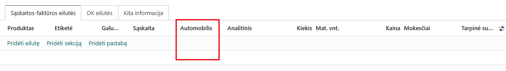

If services related to the vehicle were purchased, the information is displayed here on the vehicle card:

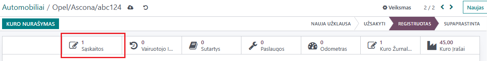

When purchasing fuel:

- Clicking this button opens a window with the entire fuel history:

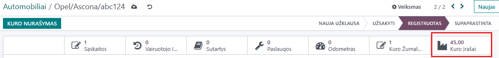

In the opened window, the purchased quantity, write-offs, and remaining fuel balance are displayed.

Fuel write-off is performed on the vehicle card by clicking the button:

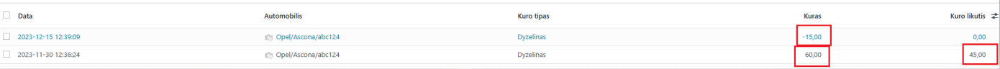

A window opens:

- Select a vehicle.
- Specify the date for the fuel write-off.
- Enter the amount of fuel to be written off.
- Click "Write off".

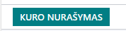

After forming the fuel write-off record, go to the "Fuel Journal":

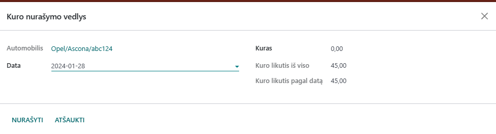

Here, draft entries are created, which need to be registered to ensure that the data and figures are recorded in the general ledger:

Before registering, by clicking on the desired line, you can check the correspondence that will register:

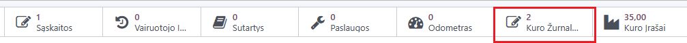

If everything is correct, return to the Fuel Journals, mark the entry you want to register, and click Action -> Post Entries.

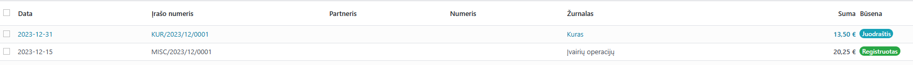

4. Reports and Documentation
-----------------------------

How to generate reports using the module.

Instructions for document management and archiving.

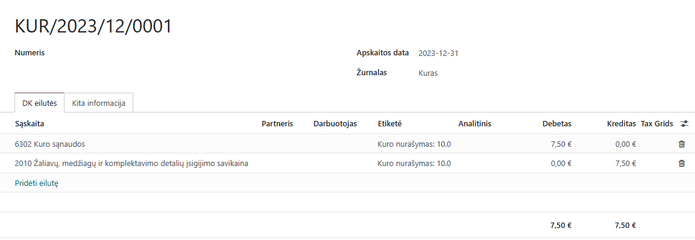

5. Integrations and Connection with Other Modules
------------------------------------------------

How this module integrates with other Odoo modules or external systems.

Special integration instructions if needed.

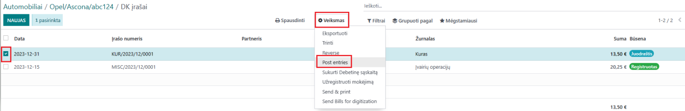

6. Troubleshooting and FAQ
--------------------------

Frequent problems and their solutions.

Answers to frequently asked questions about this module.

7. Updates and Version Management
---------------------------------

How to update the module.

Version management practices.

8. Appendices
-------------

Screenshots and visual instructions.

Useful links and additional resources.