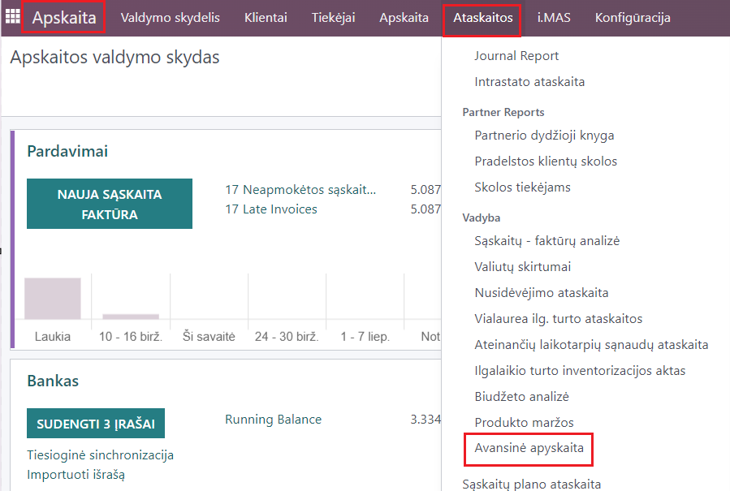
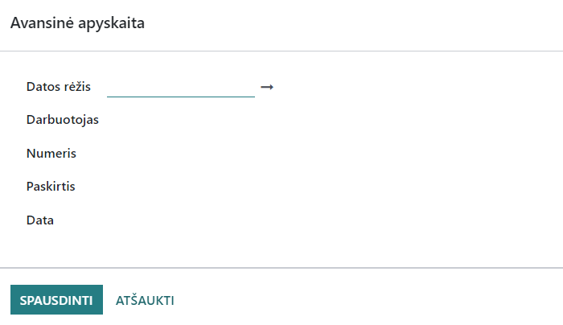

Advance Payment Reports
=======================

l10n_lt_adv_pay_report

Introduction
------------

- This function allows generating and printing advance payment reports by employees and date.

Installation and Configuration
------------------------------

- No additional installation or configuration is required.

Main Functions
--------------

- A detailed description of each important function.
- Step-by-step instructions on how to use these functions.

Daily Use Scenarios
-------------------

- Go to Accounting -> Reports -> Advance Payment Report.
- Set the report generation parameters:
  - Date range - select the period for which you want to print the advance payment report;
  - Employee - select the accountable person;
  - Number - enter the advance payment report number;
- Click "Print".

Reports and Documentation
--------------------------

- How to generate reports using the module.
- Instructions for document management and archiving.

Integrations and Connections with Other Modules
-----------------------------------------------

- Information for this report is obtained from transactions related to Accountable Persons.

Problem Solving and FAQs
------------------------

- The most common problems and their solutions.
- Answers to frequently asked questions about this module.

Updates and Version Control
----------------------------

- How to update the module.
- Version control practices.

Attachments
-----------

- Screenshots and visual instructions.
- Useful links and additional resources.
