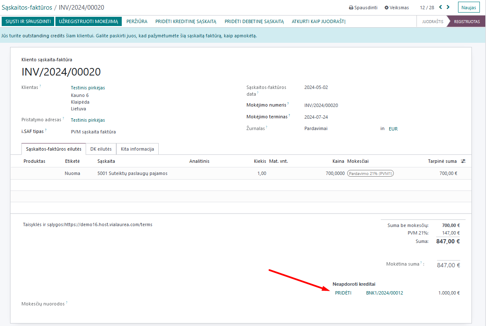

Registration of advances
========================

1. Introduction
---------------

Instructions on how to correctly register received/paid advances in the Odoo system and reconcile them with received or issued invoices.

2. Installation and Configuration
---------------------------------

To properly use the Advances module, you must first configure it by creating the "Advances" journal and specifying accounts from the chart of accounts. To do this, in Accounting, go to Configuration, and in the Settings section, select the accounts and the created journal.

3. Daily Use Scenarios
----------------------

When receiving or paying an advance, select the appropriate accounts from the chart of accounts when registering it in accounting.

After issuing an invoice and registering it in accounting, you will see the mentioned advance at the bottom of the document:

By clicking the "Add" button, an automatic entry will be created, which will transfer the amount from the advance payment account 4420 to the account where the buyer's debt is registered (in our case, 2410) on the invoice date.

If you click on the "Reconciled items" field, as shown by the arrow, the related general ledger entries for this automatic operation will open:

Based on these entries, you can see how the invoice amount is transferred from the advance and reconciled with the receivable amount.
Similarly, by selecting the appropriate accounts, you can also reconcile paid advances with payable amounts.
