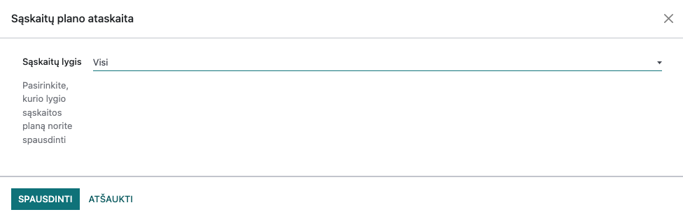
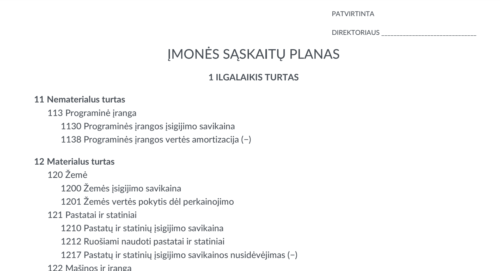
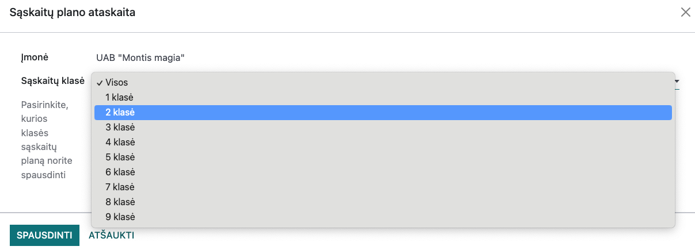

Chart of Accounts Report
========================

This report is intended to print the current company's chart of accounts.

Installation and Configuration
------------------------------

- Install the module `account_coa_report`.
- The report is based on account groups, so you can enter account groups in the parameter Accounting >> Configuration >> Account Groups (visible in debug mode). It is not mandatory to fill in this parameter; the report will work even if the parameter is not filled.

Main Functions
--------------

- To print the report, select Menu: Accounting >> Reports >> Chart of Accounts Report
- In the only parameter, you can choose which account class you want to print. If you want to print the entire chart of accounts, select account class = All

- Press the PRINT button to generate a .pdf document with the company's chart of accounts.

- If the parameter Accounting >> Configuration >> Account Groups is filled, the report can be printed hierarchically, i.e., the chart of accounts is arranged according to parent values, for example: Assets >> Fixed Assets >> Tangible Assets, etc.
- If the parameter Accounting >> Configuration >> Account Groups is not filled, the report will be printed without account class names, i.e., only the list of accounts.

Daily Use Scenarios
-------------------

- In the report parameter, you can choose which account class you want to print.
- If you want to print the entire chart of accounts, select account class = All.
- If you want to print only one account class, for example, class 2, select only one class in the parameter and press PRINT.

Integrations and Connections with Other Modules
-----------------------------------------------

- The module is related to the Lithuanian localization module Lithuania - Accounting (technical name l10n_lt) and the module Lithuanian CoA Groups (technical name l10n_lt_groups).
