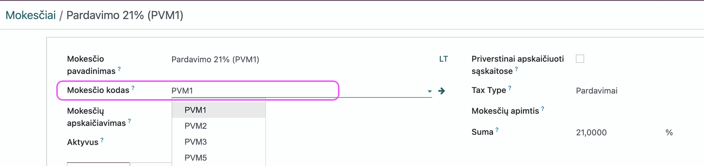
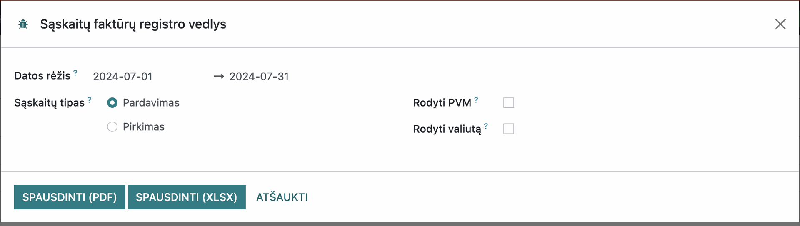
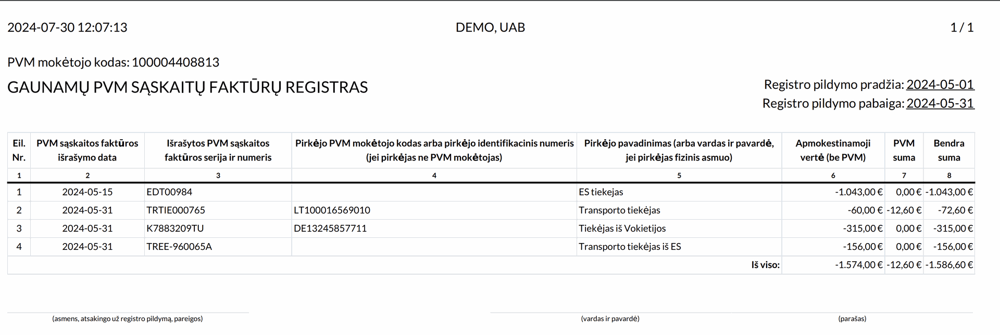
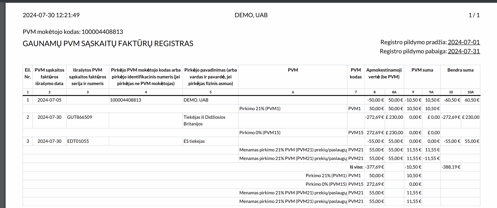

Invoice Registry
================

Introduction
------------

- Until October 1, 2016, VAT payers had to submit forms FR0671, FR0672 approved by VMI.
- From October 1, 2016, taxable persons are required to use i.MAS to submit data on issued and received VAT invoices (see iSAF declaration submission instructions for more details).
- From October 1, 2016, VAT invoice registers (received and issued) are in a free-form report format.
- Documents in the received VAT invoice register are registered by their receipt date.
- All VAT invoices for the supply of goods and/or services and advance receipt VAT invoices issued by the VAT payer during the tax period must be registered in the issued VAT invoice register, except for VAT invoices for non-taxable financial services.

Installation and Configuration
------------------------------

- Install the modules `l10n_lt_invoice_registry` and `l10n_lt_tax_code`.
- For configuration, you need to set the VAT classifier codes approved by the State Tax Inspectorate (VMI). Select the main menu - Accounting -> Configuration -> Taxes.

- In the tax environment, the tax code field is mandatory and must be filled in for all VAT taxes in the database.

Main Functions
--------------

To print the report, select Accounting >> Reports >> Invoice Registers. The launch parameter window will open:

In the launch parameters, you need to select:

- **Date Range** - select the period for which you want to generate the report; specify the dates from and to. Mandatory to fill in.
- **Invoice Type** - specify whether you will generate a report for received (purchase) or issued (sales) invoices. Mandatory to fill in.

- **Show Currency** - you can check the box, this field is optional. If selected, the report will display invoice amounts in both EUR and foreign currency.
- **Show VAT** - you can check the box, this field is optional. If selected, the report will display total amounts broken down by each VAT code at the bottom of the report.

The report can be generated into a .pdf document and a .xlsx document.

Daily Use Scenarios
-------------------

- It is recommended to generate the report before submitting the iSAF declaration (see iSAF declaration submission instructions for more details) and the VAT declaration FR0600 (see FR0600 instructions for more details).

Updates and Version Control
----------------------------

- The module is updated with each new Odoo version.
