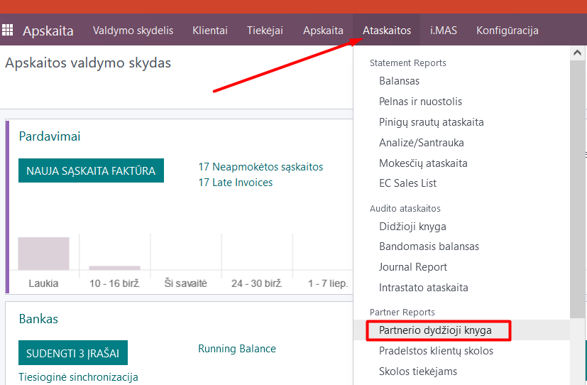
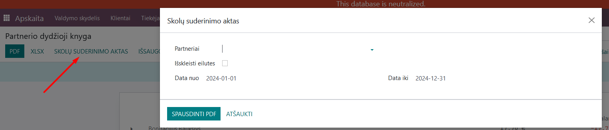
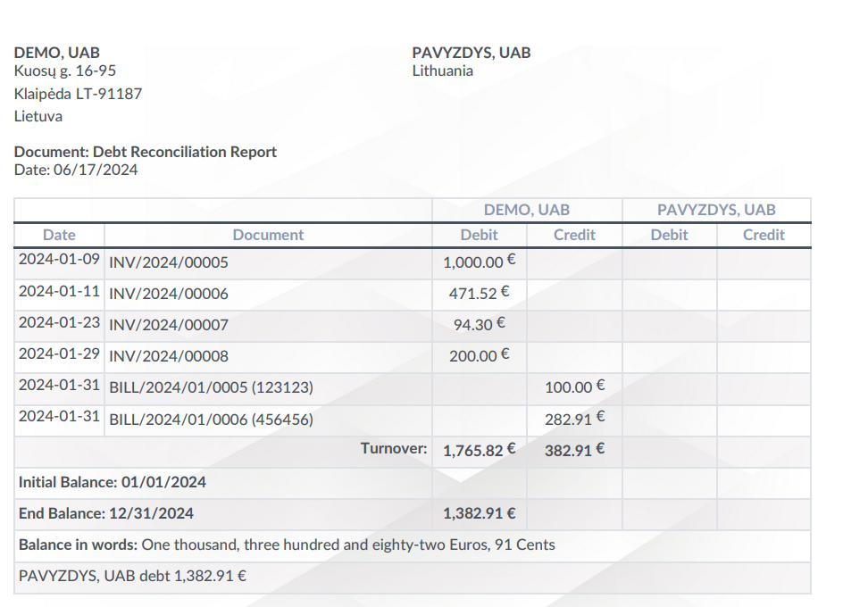
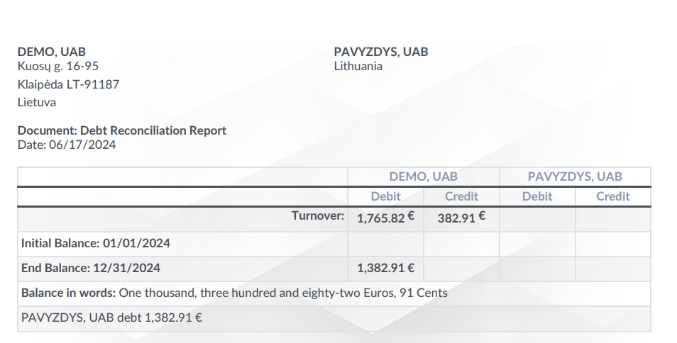
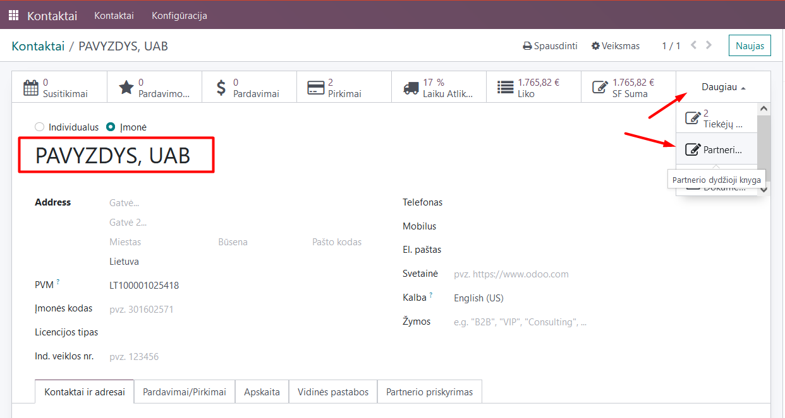
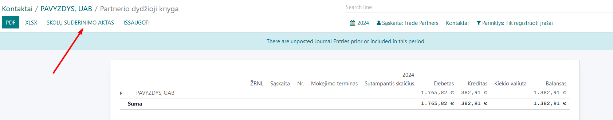

Mutual Reconciliation Act
=========================

Introduction
------------

Mutual debt reconciliation acts (EUR) can be generated in detailed form - with all transactions, or in summary form - including only the overall result of the specified period. To generate a reconciliation act for a specific partner/client, you can find this report in the Accounting module by selecting Reports/Partner Ledger.

Daily Use Scenarios
-------------------

### Printing a Detailed Mutual Debt Reconciliation Act:

In the partner ledger list, click the "Debt Reconciliation Act" button.

In the opened window, select the partner, the start and end dates of the period. Check the "Expand lines" box.
Click the "Print PDF" button. This will generate a file in PDF format.

### Printing a Summary Mutual Debt Reconciliation Act:

In the partner ledger list, click the "Debt Reconciliation Act" button.

In the opened window, select the partner, the start and end dates of the period. Do not check the "Expand lines" box.
Click the "Print PDF" button. This will generate a file in PDF format.

### Printing Reconciliation Acts for Multiple Partners in a Batch:

This method is used when you need to print reconciliation acts for several partners at once. In this case, repeat all the steps described above according to your needs. In the partner field, select several required partners from the list. A single PDF file with the reconciliation acts for all your selected partners will be generated sequentially.

Note: You can also access the partner ledger directly from the Contacts module. In the Contacts module, select the required partner, go to their card, and select the "More" button "Partner Ledger."

In the opened form, you can choose the "Debt Reconciliation Act" button and follow the previously described instructions for the printing form.

