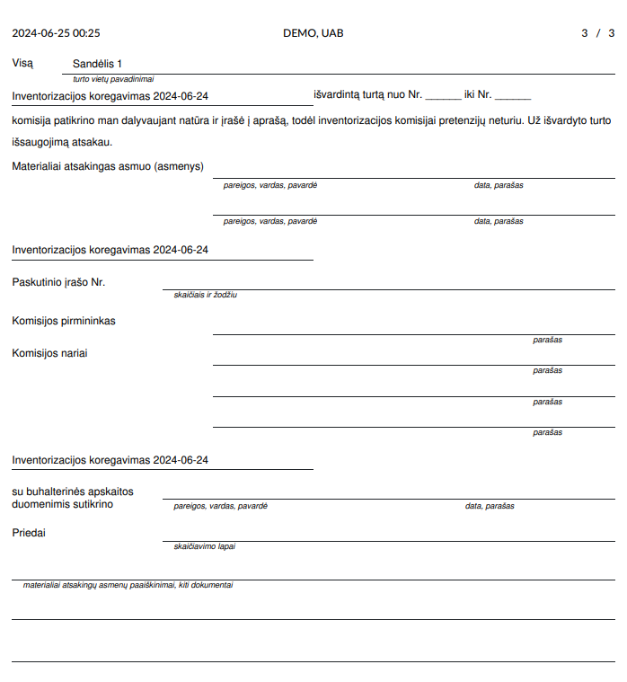

Inventorization Act
===================

Introduction
------------

You can find the Inventory Inventory Act in the Inventory module under the Reports section:

Daily Use Scenarios
-------------------

In the opened window, specify when the inventory starts and ends.
- Locations: specify from which warehouse "location" the items are inventoried.
- Filling Form: this is the inventory form adapted for manual entry of actual quantities.
- Choose whether to display items whose quantities have changed at the top of the table. Choose whether to combine locations and serial numbers. By default, a vertical sheet is printed, but there is an option to print a horizontal sheet.
- Fill in the inventory accounting date. Select inventory adjustment, enter the basis for preparation, date, chairman of the commission, members, materially responsible persons, and accountant.

When "Filling Form" is selected:

When "Filling Form" is not selected:

Note
----

- Shortage/Surplus is calculated by subtracting the Accounting Quantity from the Actual Balance. At the bottom of the act, the Shortage value is shown with a minus sign, and the Surplus with a plus sign.
- It is very important to note that the inventory act itself does not take data from what happened on the Inventory Day with transfers (IN, OUT, Internal, Write-offs). However, if this was done, it distorts the act with values. For example, if you conducted an inventory on 2023-12-28 and an OUT operation occurred on that day, the product is no longer in the warehouse, but the inventory was already started, and in this case, it is recorded that the quantity remained as it was unless a quantity adjustment was made during the inventory. This is a very important point: no transfers can be made during the inventory, except for the inventory adjustments themselves.