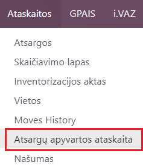
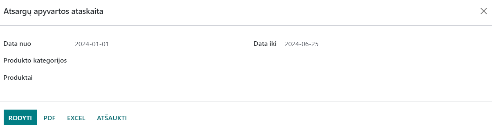
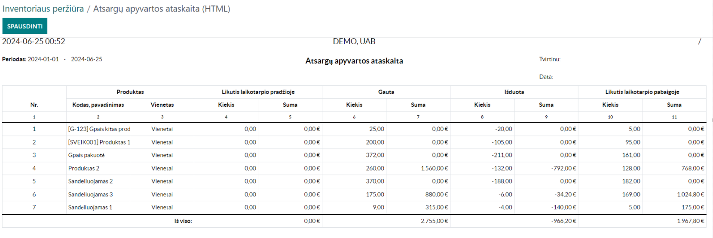

Inventory Turnover Report
=========================

Introduction
------------

You can find the Inventory Turnover Report in the Inventory module under the Reports section:

Daily Use Scenarios
-------------------

In the opened window, select the period for which you want to print the Inventory Turnover Report.
You can print the report by product categories or specific products.
The report can be viewed in the Odoo system, or printed in PDF or Excel format.

