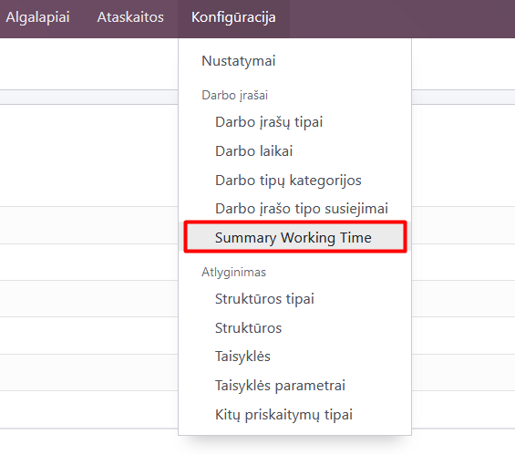
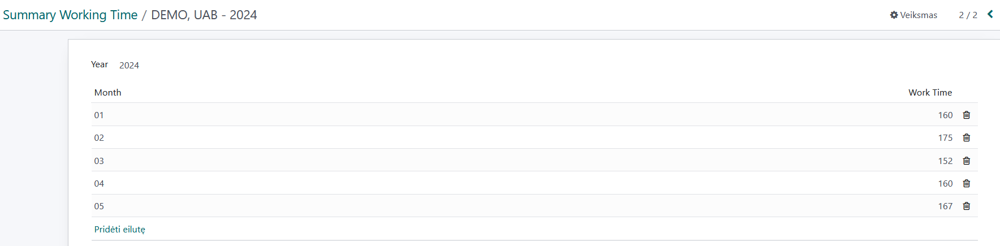
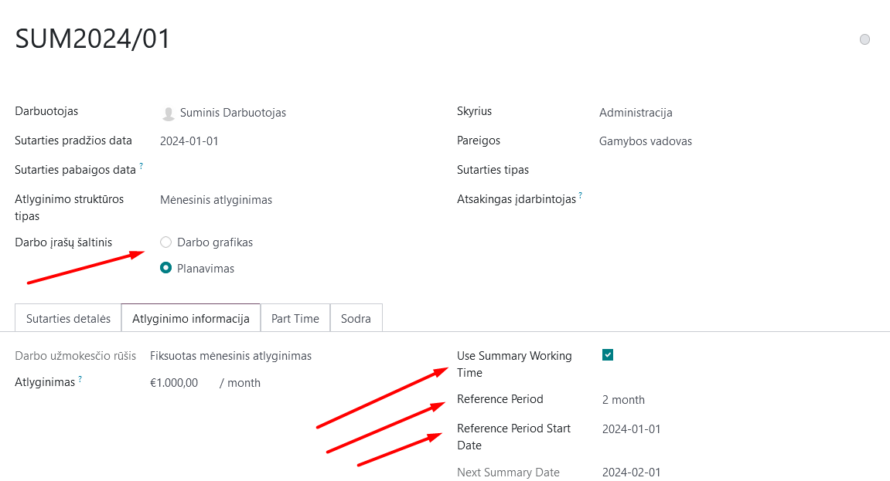
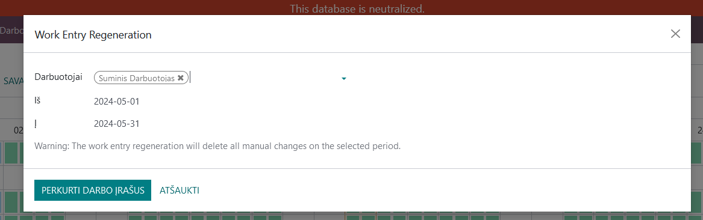
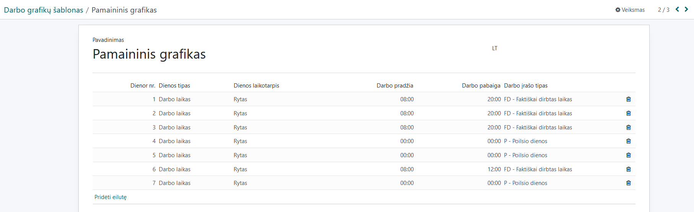
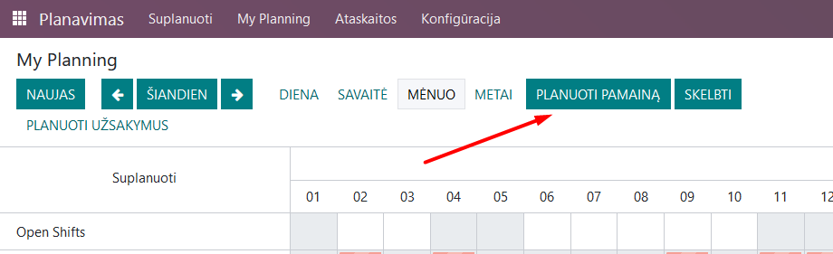
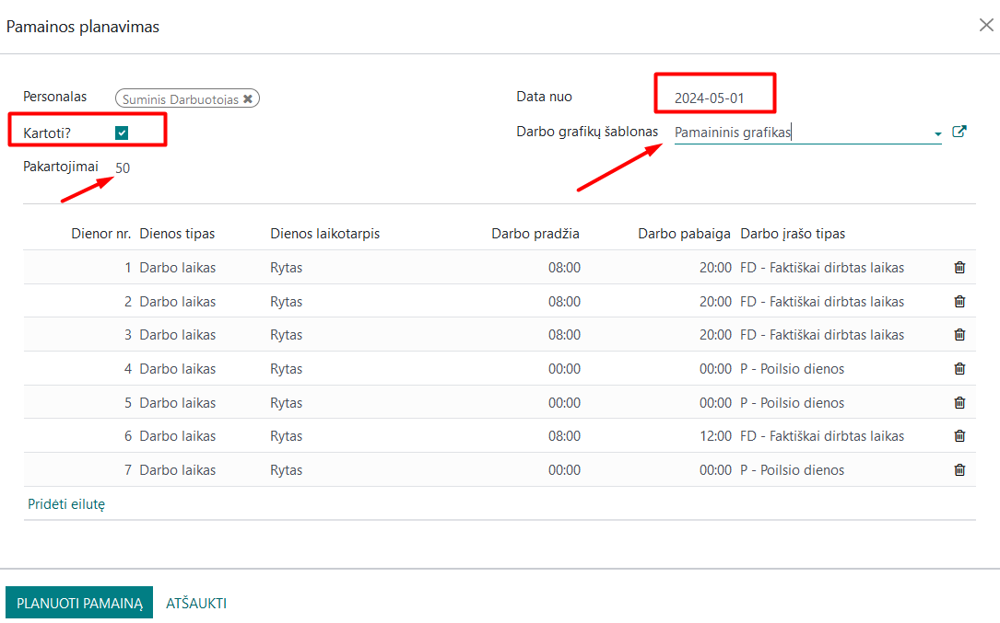
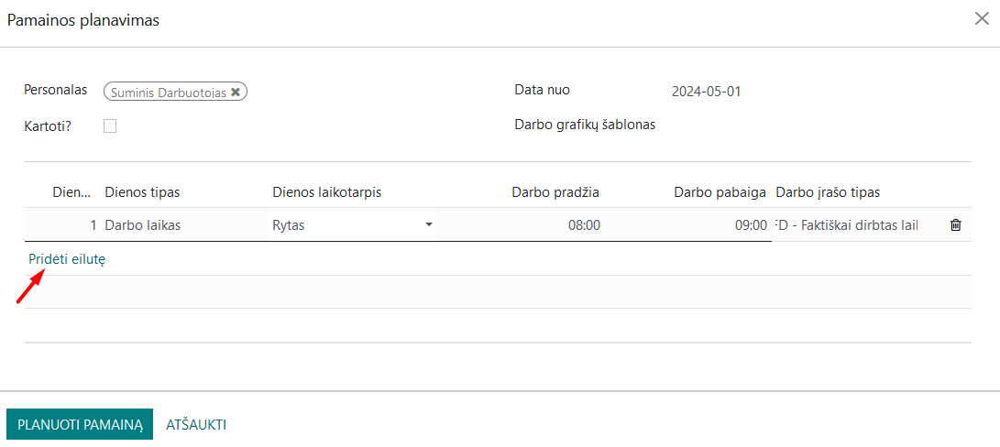
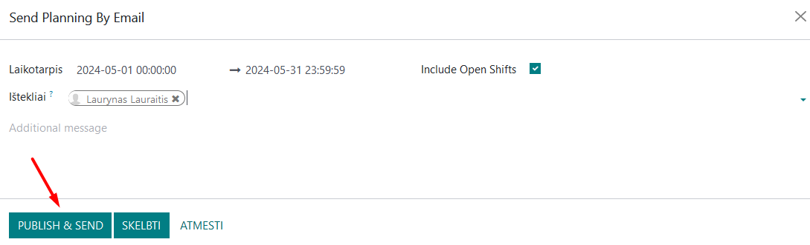

Cumulative working time accounting
==================================

.. contents::
   :local:
   :depth: 2

1. Introduction
---------------
This module is designed for payroll calculation for companies using cumulative working time accounting.

2. Installation and Configuration
---------------------------------
The following modules are related to the calculation of cumulative working time: Employees. To start using cumulative working time accounting and payroll calculation, the following settings need to be implemented:

1. In the Payroll module, under configuration, enter the current year's working hours per month at the "Summary working time" point.

For a specific employee's contract, it must be stated that cumulative working time accounting applies. If cumulative working time accounting is to be applied to an existing employee, the previous employment contract is terminated, and a new one is created. Necessary fields in the employment contract include:
- Check the "Use summary working time" box
- Select the cumulative period applied (from 1 to 4 months)
- Set the start date of the first period
- Choose whether the Planning module or work schedule will be used for timekeeping.

After these settings are made, you can start calculating wages according to cumulative working time accounting.

3. Main Features
----------------
Detailed description of each important function and step-by-step instructions on how to use these functions.

4. Daily Usage Scenarios
------------------------
As usual, before calculating salaries, information must be entered into the Time-off module about business trips, absences, holidays, etc. If the source of work records is the work schedule, it is defined just as when calculating non-cumulative working time payroll. Before calculating the salary, in the Payroll module, under the "Work Records" section, update the work record information and make adjustments if necessary.

Important: If you make manual adjustments (e.g., adjusting working hours, adding overtime, etc.) do not update the specific employee's work records afterward. Otherwise, after the update, all manual adjustments are canceled, and they need to be entered again.

After arranging the work records, the payroll for the employee is calculated in the usual manner, as when not applying cumulative working time accounting.

If the Planning module is used for time accounting:
- A standard schedule template may be used, assigning it to the employee. The work schedule template is created in Planning/Configuration/Work Schedule Templates.

To assign this template to an employee, in the Planning module click "Schedule shift", select the employee, the date, when their first shift begins, the work schedule template, and the information about working time is automatically filled in based on the chosen template. If the schedule is repetitive (say 2 working days and 2 days off), check the "Repeat" box and select the number of repetitions.

If you do not wish to use a schedule template, in the opened "Schedule shift" card, you can enter schedule lines manually using the "Add line" button. When entering the schedule in this way, you still have the option to choose repetition and specify the number of periods.

After making all the desired schedule entries for the accounting month, press the "Publish" button. In this way, the specific employee is emailed their work schedule and the information from the Planning module is transferred to the Payroll module.

5. Reports and Documentation
----------------------------
All possible reports remain the same as in the case of standard payroll, cumulative working time accounting is an additional functionality of the Payroll module. Currently, no additional reports are planned.

6. Integrations and Relationship with Other Modules
---------------------------------------------------
The calculation of cumulative working time is part of the Payroll module.

7. Problem Solving and FAQs
---------------------------
Common problems and their solutions.
Answers to frequently asked questions about this module.

8. Updates and Version Management
---------------------------------
How to update the module.
Version management practices.

9. Appendices
-------------
Screenshots and visual instructions.
Useful links and additional resources.