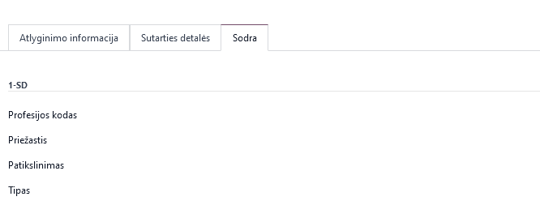
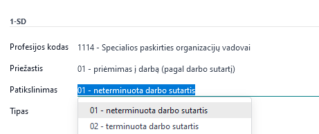
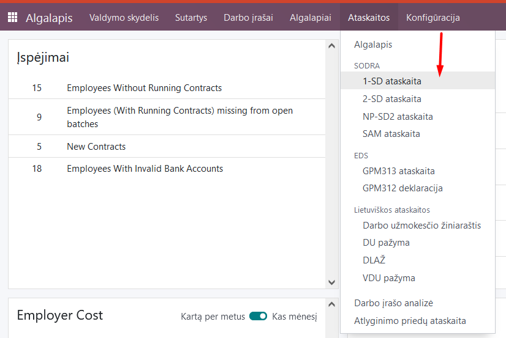
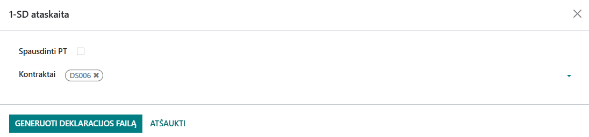
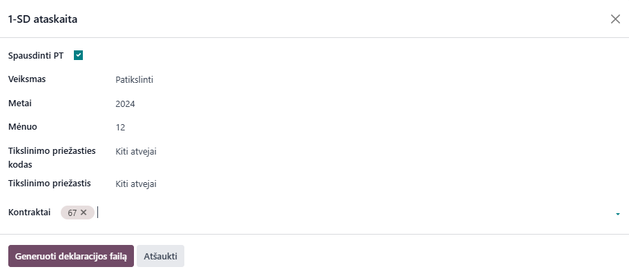

1-SD declaration
=====================

1. Introduction
------------
1-SD is the official standard form of the Social Insurance Institution (Sodra) created when hiring an employee. When an employment contract is concluded with an employee, the 1-SD notification must be submitted no later than one working day before the scheduled start of work. This form can also be submitted to the director on his first working day. The notification must be submitted in the electronic Sodra system through the personal "Sodra" account of the insured person.

2. Installation and Configuration
---------------------------------
The Sodra 1-SD module (technical name l10n_lt_sodra_1sd) is installed, and the Lithuanian Payroll module (technical name l10n_lt_hr_payroll_vl) is also required.

3. Main Features
----------------
In order for all information to be filled in when submitting a 1-SD report from the program, the information for generating a 1-SD report must be filled in the employee's employment contract. Go to Employees >> Specific employee card >> Employment contract >> Sodra.

Fill in the required fields by selecting the appropriate items from the expanded extension and save.

After entering the employee's data in the "Employees" module and creating an employment contract, go to the Payroll module >> Reports >> Sodra >> 1-SD report:

In the table that opens, select the employment contract number of the employee for whom the 1-SD form is being created from the list. Click "Generate declaration file".

A .ffdata file will be created and automatically saved on your computer, suitable for uploading to the Sodra electronic system.

If you need to revise and then print the 1 SD form, checking the Print PT box will display additional fields:

After filling in the fields and selecting the DS contract to be adjusted, you can generate a .ffdata file of the declaration. A .pdf file will be created and automatically saved on your computer, suitable for uploading to the Sodra electronic system.

You can create a 1-SD .ffdata file without filling in the fields in the employee's employment contract, but in this case, these fields will have to be filled in directly on the Sodra page after uploading the file generated in the program.

4. Updates and Version Management
---------------------------------
- The module is updated with each new Odoo version.
- This instruction is valid for versions 16 and 17.