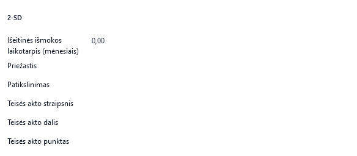
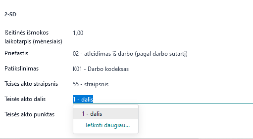
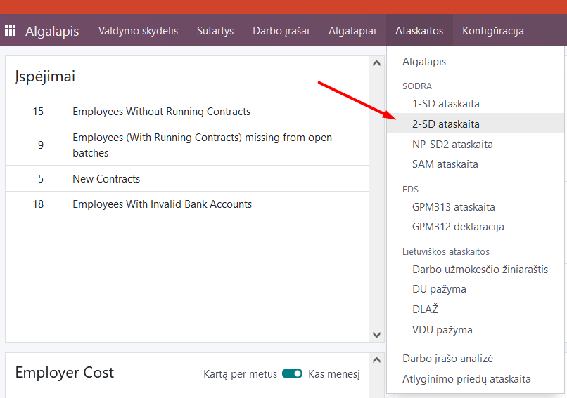
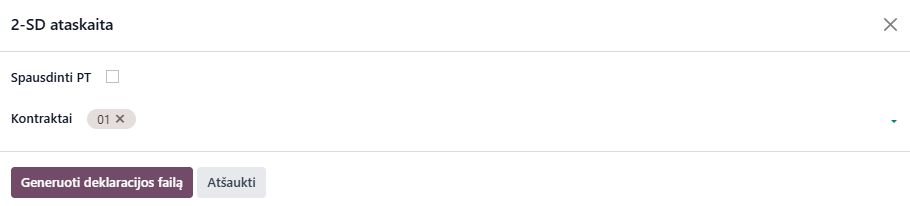
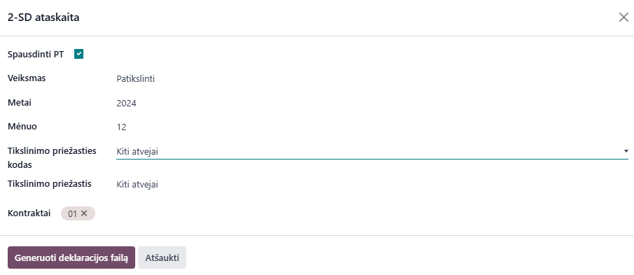

2-SD declaration
=====================

1. Introduction
------------
2-SD is the official standard form of the Social Insurance Institution (Sodra) created when an employee is dismissed. The 2-SD notification must be submitted no later than the next business day after the date of termination of the employment relationship. The notification must be submitted in the electronic Sodra system through the personal "Sodra" account of the insured person.

2. Installation and Configuration
---------------------------------
The Sodra 2-SD module (technical name l10n_lt_sodra_2sd) is installed, and the Lithuanian Payroll module (technical name l10n_lt_hr_payroll_vl) is also required.

3. Main Features
----------------
To submit a completed 2-SD form, you need to fill in the dismissal details in the employee's employment contract. Go to the Employees module, select the relevant employee's card and their last employment contract: Employees >> Employee Card >> Sodra:

In this section you will find the required fields to fill in. Enter the severance pay period manually, fill in the other fields by selecting the required item in the drop-down menu:

After entering the employee's data in the "Employees" module and creating a dismissal record, go to the Payroll >> Reports >> Sodra >> 2-SD report module:

In the table that opens, select the employment contract number of the employee for whom the 2-SD report is being created from the list. Click "Generate declaration file"

A .ffdata file will be created and automatically saved on your computer, suitable for uploading to the Sodra electronic system.

If you need to revise and print a 2-SD form, checking the Print PT box will display additional fields:

After filling in the fields and selecting the DS contract to be adjusted, you can generate a .ffdata file of the declaration. A .pdf file will be created and automatically saved on your computer, suitable for uploading to the Sodra electronic system.

You can create a 2-SD .ffdata file without filling in the fields in the employee's employment contract, but in this case, these fields will have to be filled in directly on the Sodra page after uploading the file generated in the program.

4. Updates and Version Management
---------------------------------
- The module is updated with each new Odoo version.
- This instruction is valid for versions 16 and 17.