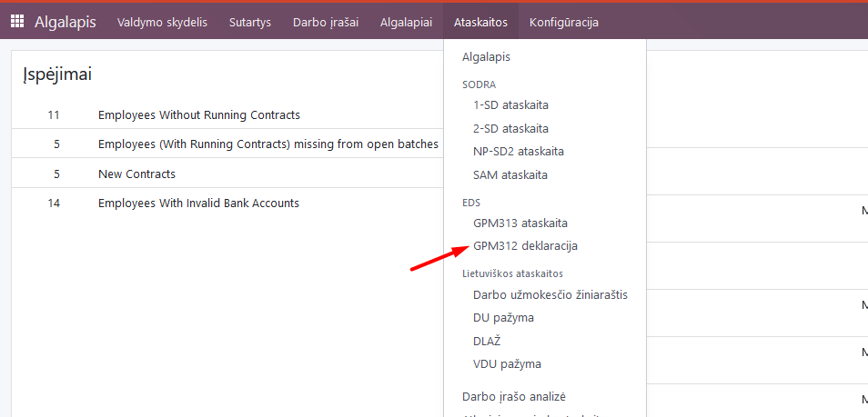
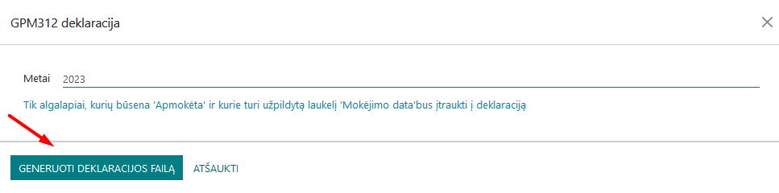
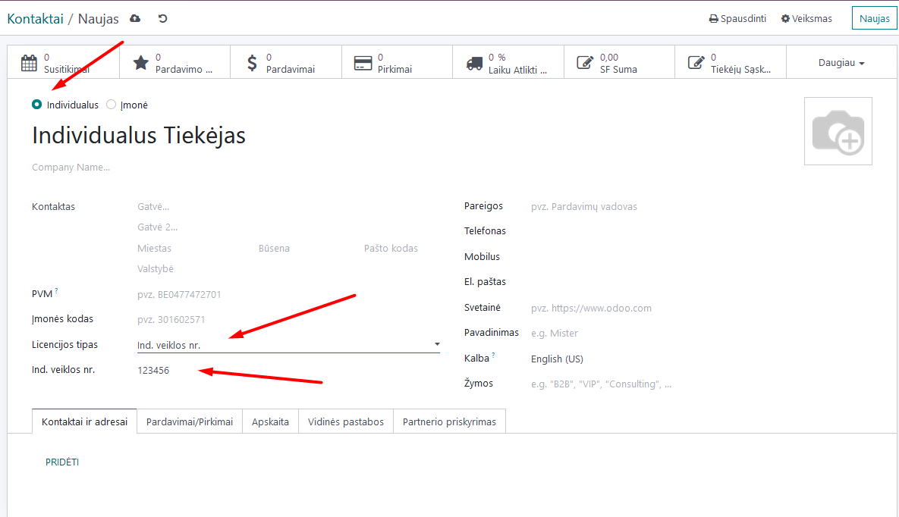

GPM 312 declaration
=====================

1. Introduction
------------
Individuals and legal entities that have paid A and B class benefits to residents during the previous year must submit a GPM312 declaration by February 15 of the current year. Income received by residents is divided into two classes according to the tax payment procedure - A and B.

Tax on class A income is calculated, deducted and paid to the budget by the person paying those benefits. For example, income related to employment (salary) of a resident is class A income, therefore the employer deducts and pays GPM (resident income tax) to the state budget.

Income tax on class B income is calculated and paid to the budget by the resident himself. For example, income from self-employed activities is classified as class B income, therefore the person carrying out such activities declares and pays personal income tax to the state budget by submitting the relevant declaration.

The annual GPM312 declaration provides the total amount credited to each employee or resident during the tax period, classified according to the relevant code as taxable and non-taxable income, and the amount of income tax deducted and paid.

2. Installation and Configuration
---------------------------------
The GPM 312 module (technical name l10n_lt_gpm312) is installed, and the Lithuanian Payroll module (technical name l10n_lt_hr_payroll_vl) is also required.

3. Main Features
----------------
You can find the annual GPM declaration in the Payroll module >> Reports >> EDS section >> GPM312 declaration.

After selecting it, specify the year and click the "Generate declaration file" button.

A file for uploading to the VMI EDS system in ffdata format will be created and automatically saved on your computer. To view the data before uploading the file to the system, use the *ABBYY eFormFiller* software.

**Important:** only those payroll amounts that have the "Paid" attribute in the Payroll module are included in the declaration. If you have not entered the payment date after calculating the salary, the data will not be included in this declaration. In order for the daily allowances paid to be included in the GPM312 declaration, they must be entered in the relevant employee's monthly payslip, as other accruals.

4. Daily Use Scenarios
---------------------------------
Using the Via laurea Salary Calculation module, there is an option to include amounts paid to individuals as suppliers (contractors) when forming the annual GPM312 declaration. To use this option, when describing the contact of the individual in the Contacts module, it is necessary to indicate that this is an individual supplier, select the appropriate item as the license type (Personal Code, IDV number, etc.) and enter a specific number as the IDV number:

When creating an invoice for this contractor, select the required activity code from the list in the GPM312 for L5 tag.

After completing these steps, the amounts paid to this individual will be included in the declaration when forming the GPM312 declaration for the relevant period.

**Important:** if the individual is not a VAT payer - data is uploaded to GPM 312 based on the date of payment of money (cash principle), if the individual is a VAT payer - the amount excluding VAT is uploaded based on the invoice date (accrual principle).

5. Updates and Version Management
---------------------------------
- The module is updated with each new Odoo version.
- This instruction is valid for versions 16 and 17.