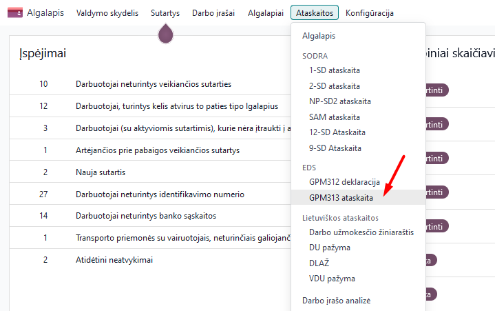
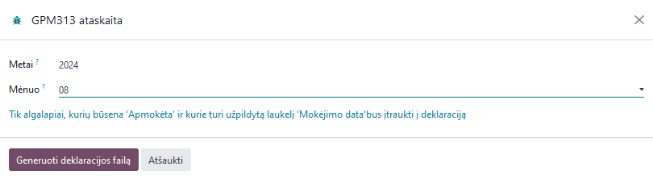

GPM 313 declaration
=====================

1. Introduction
------------
This declaration is intended to declare the amounts of money credited to employees and individuals as well as the deducted GPM, when the income is classified as class A income. The declaration for the benefits paid in the current month is submitted by the 15th day of the following month. The declaration is submitted every month.

2. Installation and Configuration
---------------------------------
The GPM 313 module (technical name l10n_lt_gpm313) is installed, and the Lithuanian Payroll module (technical name l10n_lt_hr_payroll_vl) is also required.

3. Main Features
----------------
You can find the monthly GPM declaration in the Payroll module >> Reports >> EDS section >> GPM313 report.

To create a declaration, enter the year in the window that opens and select the required month.

A file for uploading to the VMI EDS system in ffdata format will be created and automatically saved on your computer. To view the data before uploading the file to the system, use the *ABBYY eFormFiller* software.

**Important:** only the payroll amounts that have the "Paid" attribute in the Payroll module are included in the declaration. If you did not enter the payment date after calculating the salary, the data will not be included in this declaration.

4. Updates and Version Management
---------------------------------
- The module is updated with each new Odoo version.
- This instruction is valid for versions 16 and 17.