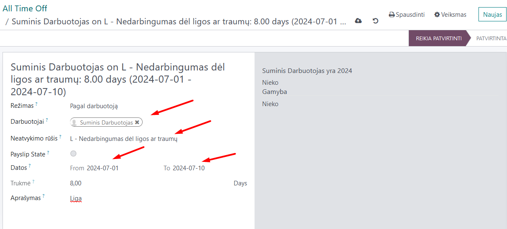
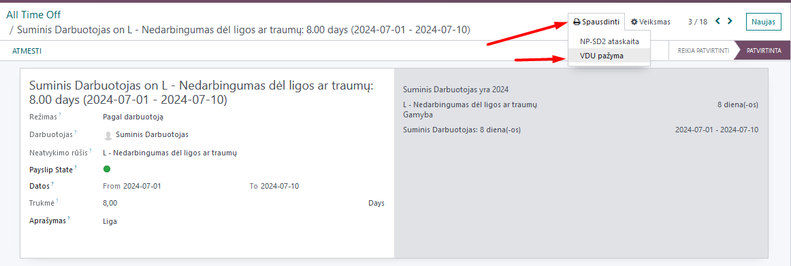
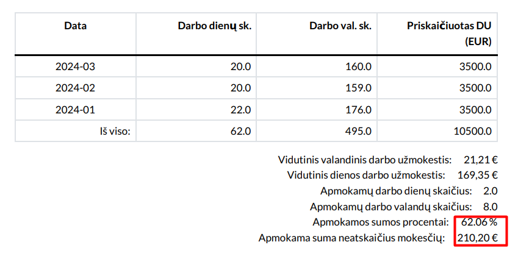
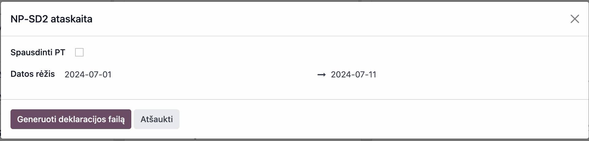
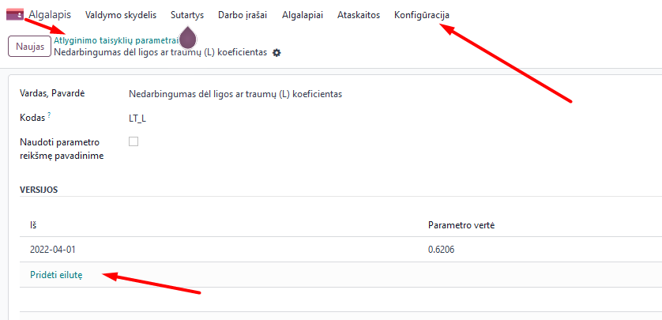

NP-SD report
=====================

1. Introduction
------------
The NP-SD report is an official notification to the Social Insurance Institution (Sodra) that an employee has become temporarily unable to work and Sodra is informed about the allocation of benefits to the employee. By submitting the report, the accountant informs Sodra about the payouts allocated to the employee by the employer.

We recommend that you fill out this declaration directly in the Sodra system, entering the absence payout calculated by the employer in the program. In this case, you will avoid having to manually enter the dates and number of the issued absence certificate.

2. Installation and Configuration
---------------------------------
The Sodra NP-SD2 module (technical name l10n_lt_sodra_np_sd2) is installed, and the Lithuanian Payroll module (technical name l10n_lt_hr_payroll_vl) is also required.

3. Main Features
----------------
In the Time Off module, create an absence record by selecting the appropriate absence type and dates and confirm it.

After confirming the absence record, select >> Printing >> "VDU certificate"

A special VDU certificate will be generated, in which you will see the amount of the absence payout, depending on the work schedule, for the first 2 working days, if they coincide with the employee's work schedule.

Enter this amount in the Sodra NP-SD notification.

You can also generate an NP-SD2 report directly from Odoo. Select Payroll >> Reports >> NP-SD2. When running the report, enter the date range from...to.

A .ffdata file will be created and automatically saved on your computer, suitable for uploading to the Sodra electronic system. Creating the file from the program is not very convenient, as the absence certificate numbers will not be included and will have to be entered manually from the Sodra system.

The amount paid is calculated based on the company's approved rules on the percentage of VDU the employer pays for the first days of incapacity for work. These percentages can be changed, if necessary, in the Payroll module: Payroll >> Configuration >> Compensation rules parameters >> Sickness or injury (L) coefficient, by entering the percentages and the date from which these percentages take effect.

4. Updates and Version Management
---------------------------------
- The module is updated with each new Odoo version.
- This instruction is valid for versions 16 and 17.