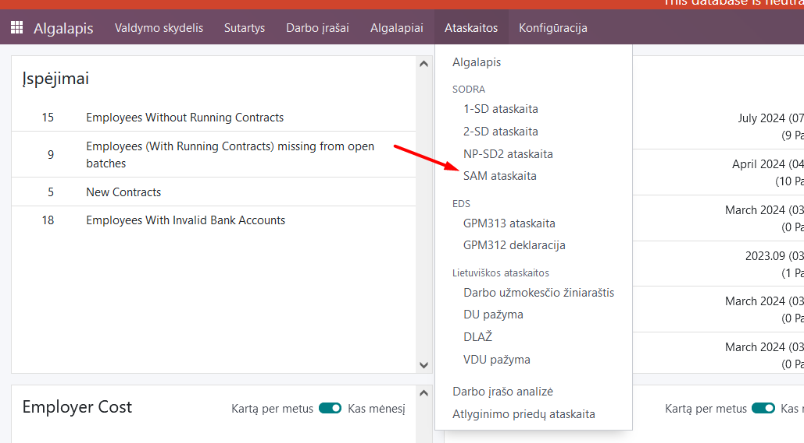
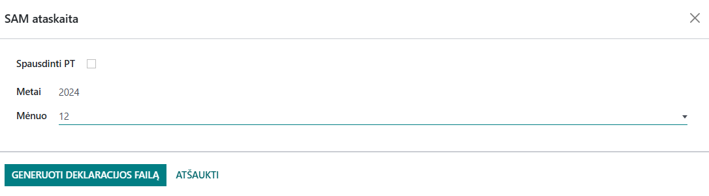
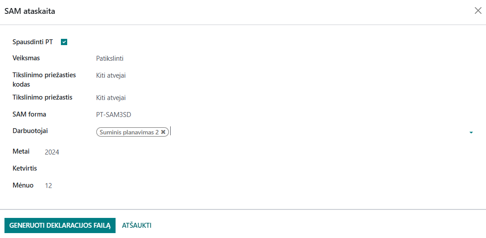

SAM monthly declaration
=====================

1. Introduction
------------
The SAM declaration is an official report to the Social Security Insurance (Sodra) in a prescribed format about the salaries and contributions of employees, which the employer must submit every month. The SAM report for the current month must be submitted by the 15th of the following month.

2. Installation and Configuration
---------------------------------
The Sodra SAM module (technical name l10n_lt_sodra_sam) is installed, and the Lithuanian Payroll module (technical name l10n_lt_hr_payroll_vl) is also required.

3. Main Features
----------------
After completing the monthly calculations and approving the payslips of all employees, in the Payslip module, select Reports >> Sodra >> SAM report.

In the window that opens, select the year and month for which the report is being generated. Click "Generate declaration file".

A .ffdata file will be created and automatically saved on your computer, suitable for uploading to the Sodra electronic system.

If you need to submit a revised SAM form, checking the Print PT box will display additional fields:

After filling in the fields and selecting the employee whose salary is being adjusted, you can generate a declaration .ffdata file for submission to the Sodra system.

4. Updates and Version Management
---------------------------------
- The module is updated with each new Odoo version.
- This instruction is valid for versions 16 and 17.