Personnel Accounting
--------------------

Introduction
------------

- The "Employees" module is used for personnel accounting, entering employee data, creating contracts, and more.

Installation and Configuration
------------------------------

- In the Employees module, company departments are entered in the configuration section, and accounting accounts are set for payroll accrual entries. This way, payroll expenses can be allocated as needed, for example, separating production employee expenses from administration employee expenses. The department/division manager can also be specified, and a higher division can be assigned if needed.

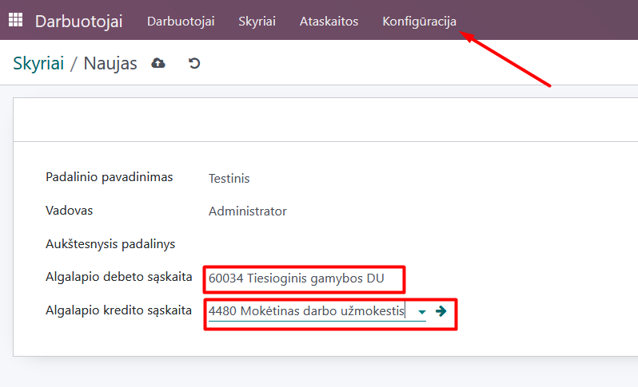

Daily Use Scenarios
-------------------

Creating an employee card:
Important: The employee card is linked to the "Contacts" module, and when a new employee is created, their data is automatically duplicated into the Contacts module.
When entering new employee data, select "New".

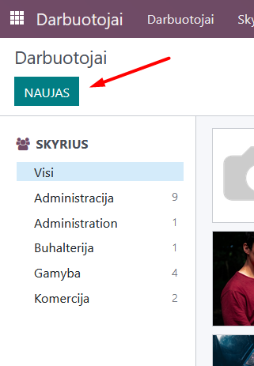

Enter the employee data in the opened card:

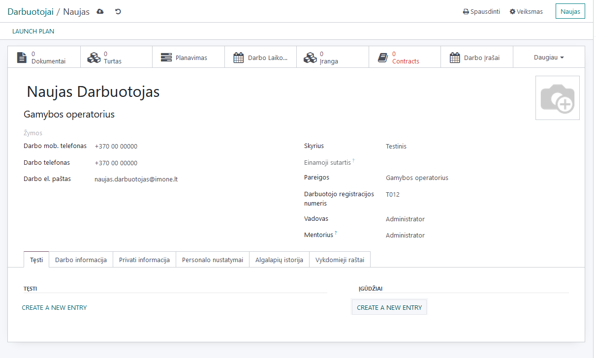

In the "Work Information" tab, fill in the responsible person who will approve absence records and timesheets. Entries from the assigned department/division data are automatically filled in, but they can be changed if necessary. Choose the work schedule that matches the specific employee's working hours.

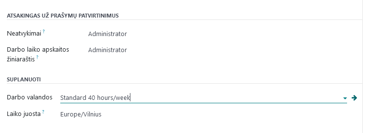

In the "Private Information" tab, enter data about education, certificates, marital status, etc. In the personnel card, enter the advance payment to be paid monthly, if applicable. In the executive orders, enter data about deductions from wages according to executive orders.
It is important to note that departments, positions, etc., can be created not only in the Configuration section but also directly in the employee card. When a new name is entered, a "Create and edit" link appears, directing the user to the creation window. The example shows the creation of a new department directly from the employee card while entering data.

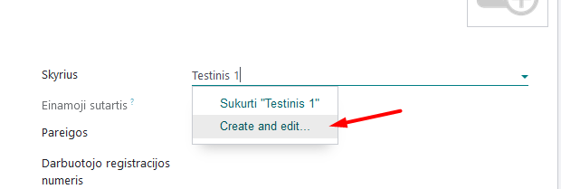

Entering employment contract information:
To enter employment contract information, select the "Contracts" section in the employee card.

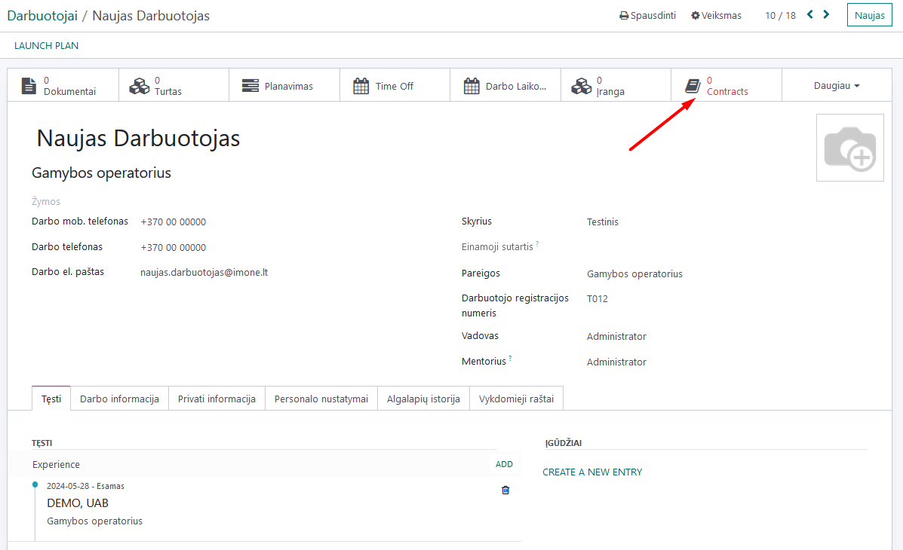

In the opened window, click "Create".

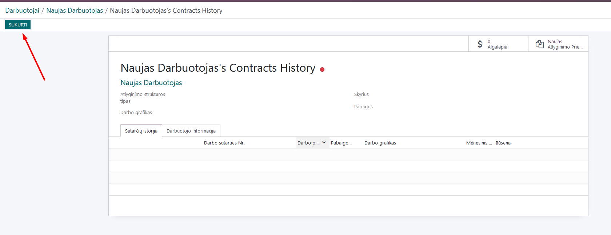

In the first tab "Contract Details", it is necessary to specify the source of work entries, the configured schedule if chosen, the type of employment contract, the application/non-application of NPD, and pension accumulation if the employee contributes to the second pillar pension.

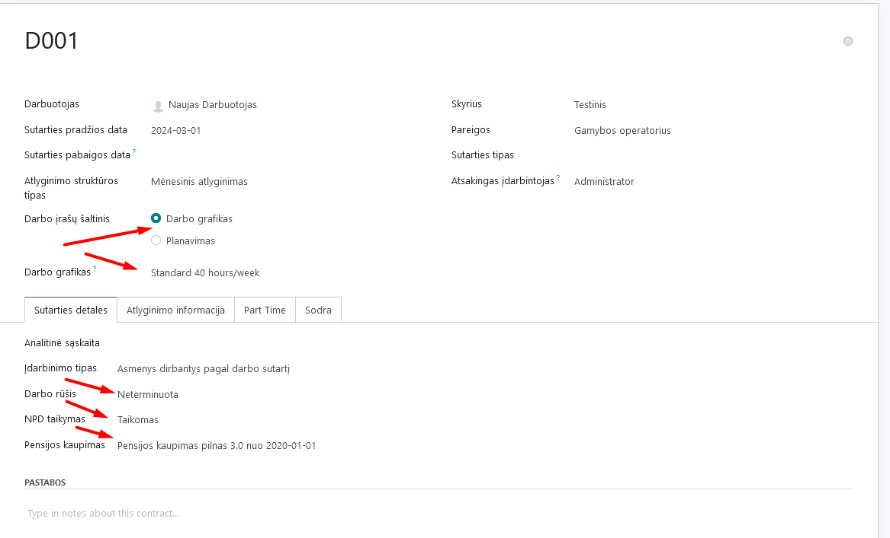

In the salary information, specify the salary. If cumulative working time accounting is applied, mark it and specify the frequency and the start date of the first period of cumulative accounting.

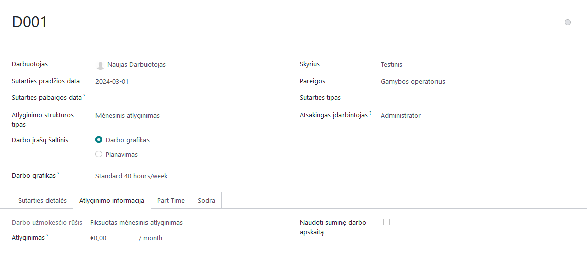

In the part-time section, if the employee works part-time, enter the appropriate data.

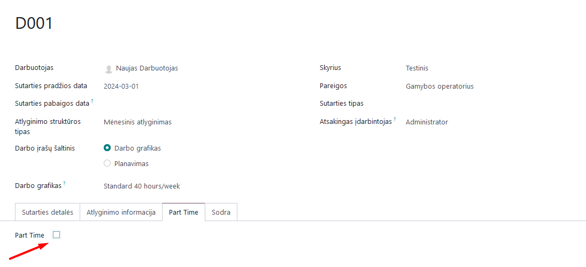

If the 1-SD report will be generated from the Odoo program, specify the corresponding points:

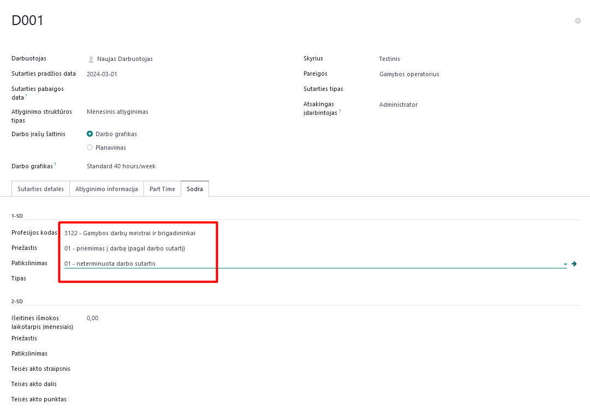

After entering all the data, save the employment contract.
Important: If there is a need to change employment contract data, the existing contract is not changed. In the employee card, the old contract is ended, and a new one is created with updated data (e.g., salary, work schedule, etc.).
All past and current employment contracts can be seen in the employee's employment contract history.

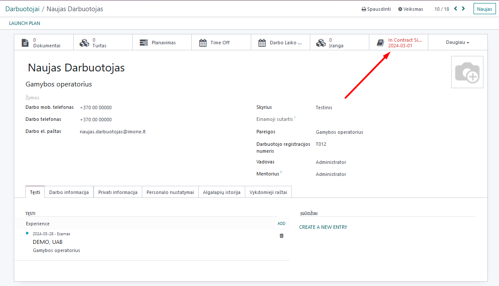

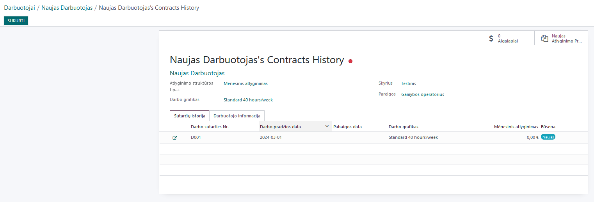