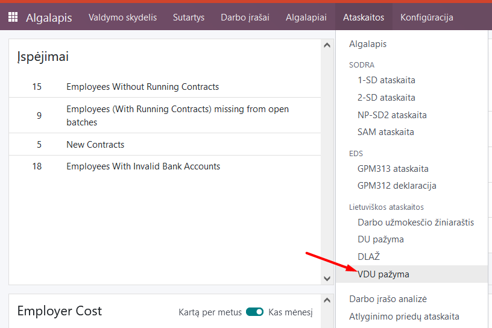
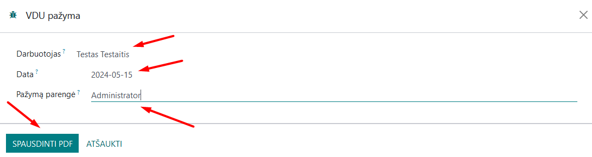
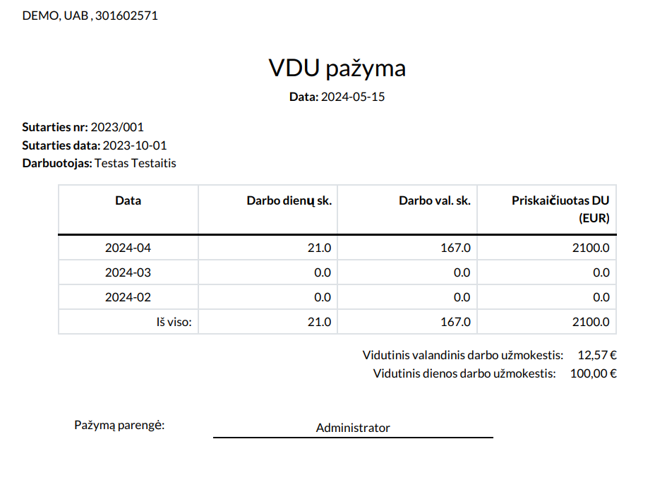

Certificate of average earnings
=====================

1. Introduction
------------
In cases where an employee must be paid an average wage (or part thereof) in accordance with the Labor Code or other labor law provisions or an employment contract, a certificate must be printed showing how that average salary was calculated.

The report is a table in a typical recommended format, formatted into a .pdf document.

2. Installation and Configuration
---------------------------------
- The Lithuanian Payroll Reports module (technical name l10n_lt_hr_payroll_vl_reports) is installed, as well as the Lithuanian Payroll module (technical name l10n_lt_hr_payroll_vl).

3. Main Features
----------------
After calculating the payroll (for more information, see Payroll calculation), we can print an average salary certificate for the employee. Select Payroll module >> Reports >> Average salary certificate.

In the table that opens, specify:

- **Employee** - select from the list;
- **Date** - specify the date for which the certificate is required;
- **Certificate preparer** - select from the Contacts list;

Click "Print PDF". One certificate can be printed per employee.

A .pdf file with data for the last 3 months prior to the entered date will be created and automatically saved on your computer.

4. Updates and Version Management
---------------------------------
- The module is updated with each new Odoo version.
- This instruction is valid for versions 16 and 17.