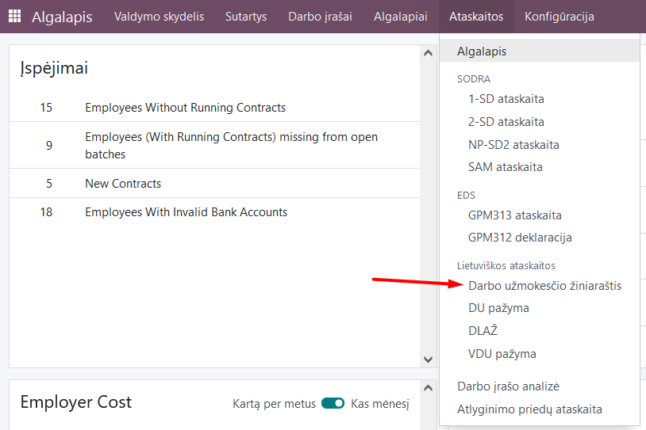
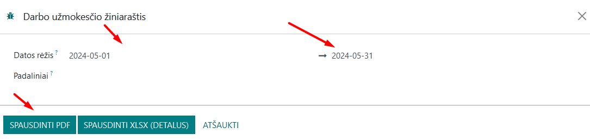
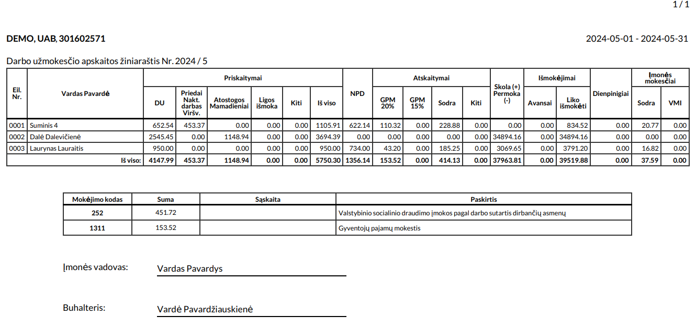

Payroll sheet
=====================

1. Introduction
------------
A **payroll accounting sheet** is a payroll accounting document that lists an employee's monthly salary data regarding credited and deducted amounts.

The report is a table in a typical recommended format, formatted into a .pdf document.

2. Installation and Configuration
---------------------------------
- The Lithuanian Payroll Reports module (technical name l10n_lt_hr_payroll_vl_reports) is installed, as well as the Lithuanian Payroll module (technical name l10n_lt_hr_payroll_vl).

3. Main Features
----------------
After calculating the payroll (for more information, see Payroll Calculation), we can print the Payroll Sheet: Payroll module >> Reports >> Payroll Sheet.

In the table that opens, fill in the date range from... to. 

To print a separate salary slip for a specific department, select the department. If you do not use departments or want to create a slip for all employees - leave this field empty.

Click the "Print PDF" button and the sheet will be saved to your computer.

You can also format the spreadsheet in .xlsx format.

4. Updates and Version Management
---------------------------------
- The module is updated with each new Odoo version.
- This instruction is valid for versions 16 and 17.