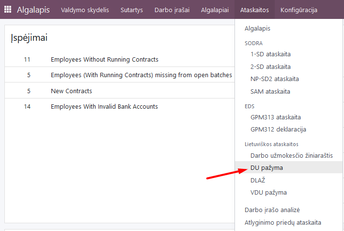
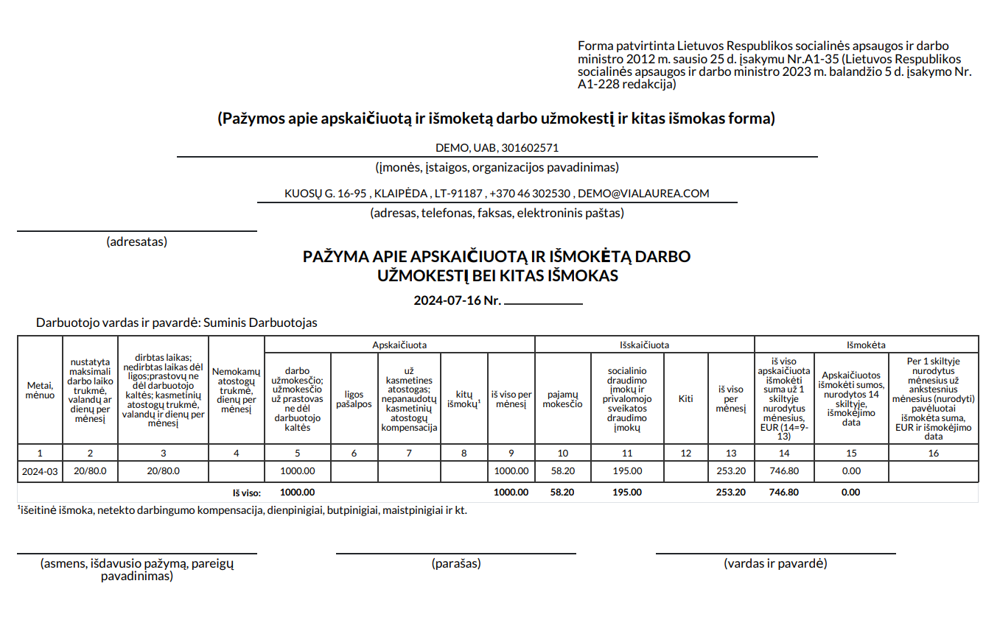

Salary certificate
=====================

1. Introduction
------------
A certificate of calculated and paid wages (salary) to an employee is a special form that is provided at the employee's request.

Most often, the employee requests the certificate because they have to submit it to other institutions, for example, a bank, kindergarten, social welfare system, etc.

The report is a table in a typical recommended format, formatted into a .pdf document.

2. Installation and Configuration
---------------------------------
- The Lithuanian Payroll Reports module (technical name l10n_lt_hr_payroll_vl_reports) is installed, as well as the Lithuanian Payroll module (technical name l10n_lt_hr_payroll_vl).

3. Main Features
----------------
To create a salary certificate, select Payroll module >> Reports >> Salary certificate.

In the opened tab, select the employee and the date range from... to for which the certificate is required. One certificate can be printed per employee.

Click "Print PDF" and a standard certificate will be sent to your computer.

4. Updates and Version Management
---------------------------------
- The module is updated with each new Odoo version.
- This instruction is valid for versions 16 and 17.