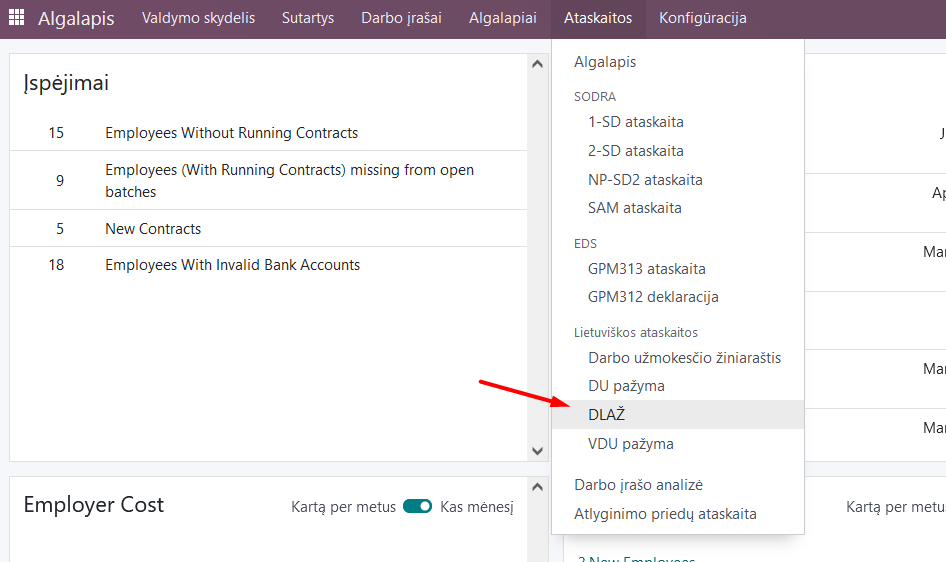
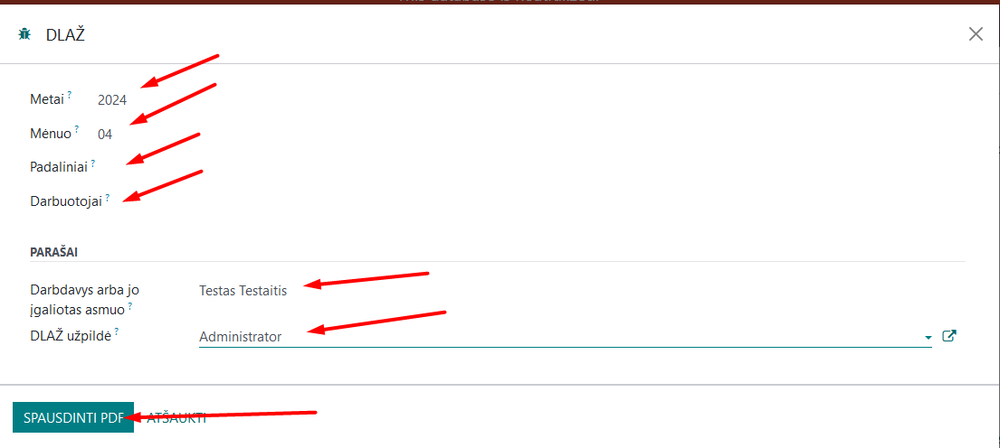
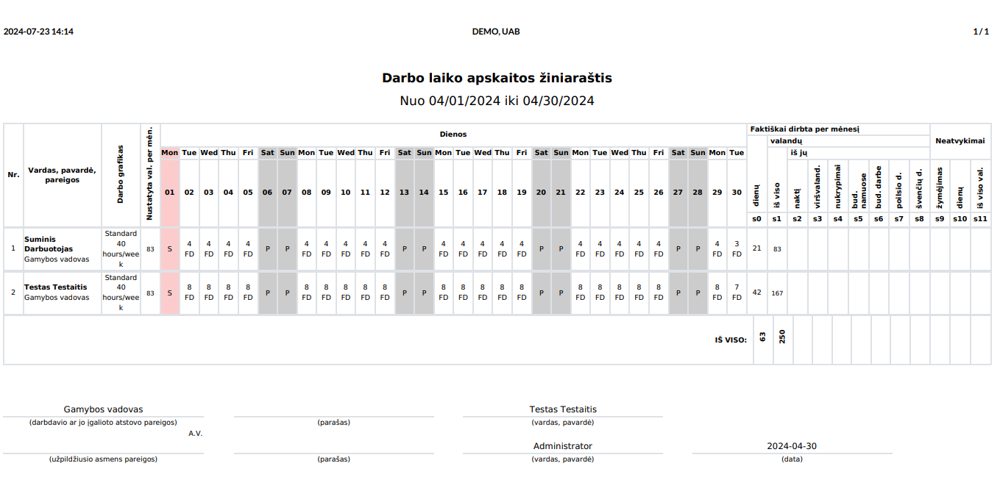

Timesheets
=====================

1. Introduction
------------
A timesheet is a special summary that can be used to correctly calculate employee wages. In the event of a dispute, the report serves as proof of work completed.

The report is a table in a typical recommended format, formatted into a .pdf document.

2. Installation and Configuration
---------------------------------
- The Lithuanian Payroll Reports module (technical name l10n_lt_hr_payroll_vl_reports) is installed, as well as the Lithuanian Payroll module (technical name l10n_lt_hr_payroll_vl).

3. Main Features
----------------
Before calculating the salary, review the work records for the relevant month (for more information, see Payroll Calculation).

Once you are ready, you can print the working timesheet: Payroll module >> Reports >> DLAŽ (timesheets).

In the table that opens, select:

- **Year** - by default, current year is always suggested, but can be adjusted manually;
- **Month** - select from the list;
- **Departments, employees** - select if you want to print separately for a specific employee or department. If you do not select it, it will print for all employees by default.

In the Signatures section, select:

- **Filled in by** - select from the Contact register (this field is optional);
- **Employer or the authorized person** - select from the Contact register (this field is optional);

Click the "Print PDF" button.

A .pdf file will be downloaded and saved to your computer for printing.

4. Updates and Version Management
---------------------------------
- The module is updated with each new version of Odoo.
- This instruction is valid for versions 16 and 17.