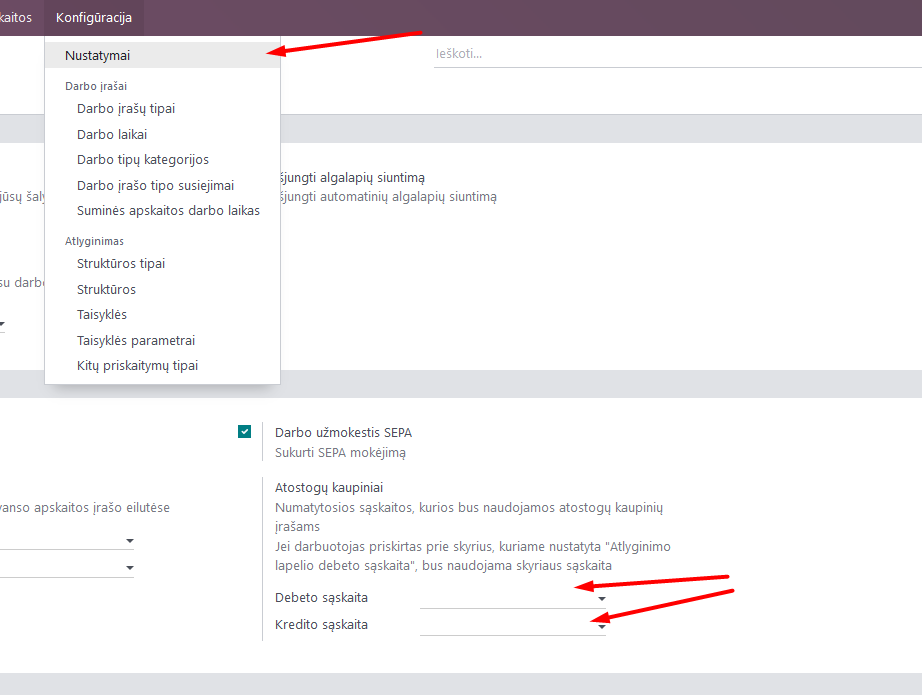
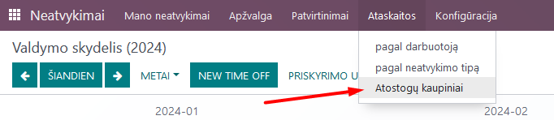
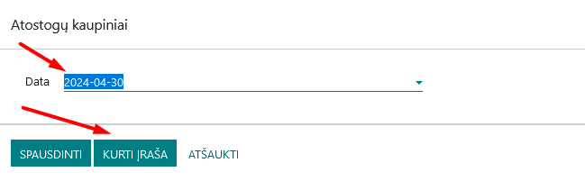

Vacation accrual report
=====================

1. Introduction
------------
Accumulated vacation is considered a liability of the company and reduces profits, so this indicator is important for both financial reporting and business planning. Therefore, at the end of the financial year, accounting specialists must calculate the number of days off employees are entitled to and create the appropriate entry in the General Ledger.

2. Installation and Configuration
---------------------------------
- The Accrued Vacation module (technical name l10n_lt_hr_accrued_vacation) is installed, as well as the Lithuanian Payroll module (technical name l10n_lt_hr_payroll_vl).
- Settings for cumulative account correspondence are managed in the Payroll module >> Configuration >> Settings, specifying the appropriate accounting accounts based on your chart of accounts:

- **Debit account** - indicates the expense account. As noted in the note next to the field, if wages are allocated to expenses by department (for more information, see Payroll Calculation), this account will not be used, but the expense account assigned to the department.
- **Credit account** - indicates a class 4 account, for example 4485 Vacation Accruals

3. Main Features
----------------
In the Time Off module >> Reports, you can find standard reports by employee and absence type, the creation of which is described in the standard Odoo Time Off module documentation.

Additionally, under Time Off >> Reports, you can see the Vacation Accruals report, which you can generate in .pdf format for the selected date.

If the account correspondences described above (in the Configurations section) are configured in the Payroll module, clicking the "Create Entry" button in the Vacation Accruals Report generation tab will create an accruals entry in the Accounting module in the General Ledger for the specified date.

A single draft ledger entry is created, which can be deleted if the data still needs to be adjusted, or it can be registered so that the data and figures are recorded in the General Ledger.

4. Updates and Version Management
---------------------------------
- The module is updated with each new Odoo version.
- This instruction is valid for versions 16 and 17.