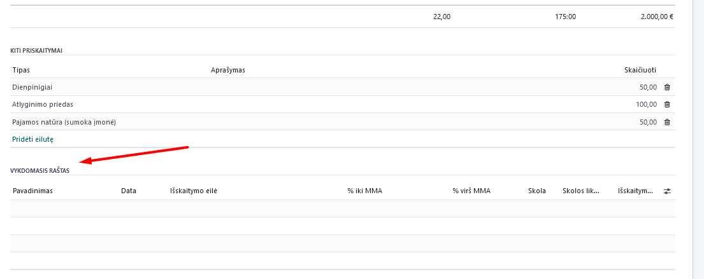
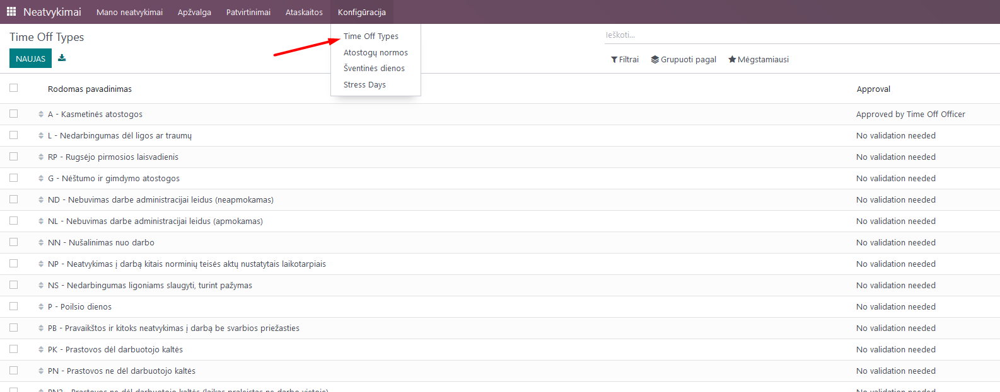

Salary calculation
==================

Introduction
------------

Payroll calculation includes employee contacts, entering employment contract information (module "Employees"), creating work schedules, absence accounting (modules "Planning" and "Absences"), work time accounting, payroll calculation, and various forms for Sodra and VMI related to payroll (module "Payroll").

Installation and Configuration
------------------------------

### Accounting Correspondences Configuration

When using payroll calculation in Odoo, it is important to set up accounting correspondences that will send information to the Accounting module upon confirming calculations. If the same account correspondences are used for all employees, it should be specified in the Payroll module, in the Configuration section, under "Rules."

Select "Monthly Salary," and in the opened list, review all lines and assign the appropriate accounting accounts in the lines where account correspondences are needed, based on your company's chart of accounts.

You can assign the account by entering the specific line in the "Accounting" tab.

.. image:: salary_calculation/image03.jpg
    :alt: Assign account in Accounting tab

You can also choose whether to display this line in the generated payslip and, if needed, select an analytical account.
If you want to use different accounting accounts for different employees, depending on the employees - check the "Use accounts from departments" box.

.. image:: salary_calculation/image04.jpg
    :alt: Use accounts from departments

In this case, account correspondences settings are made in the departments, which can be found in the Employees module, Configuration.

.. image:: salary_calculation/image05.jpg
    :alt: Department settings

Create a department card and specify the Payroll debit and credit accounts in it. Standard correspondences, such as GPM deductions from employees, remain common for all company employees.

.. image:: salary_calculation/image06.jpg
    :alt: Payroll debit and credit accounts

IMPORTANT: If you use department account correspondences, the employee must be assigned to one of the existing departments in the employee card.

### Entering Monthly Working Hours for Cumulative Work Time Accounting

If at least one employee is subject to cumulative work time accounting, before performing the first calculations, it is necessary to enter the number of working hours for the corresponding months. This is done in the Payroll module, Configuration, Cumulative Work Time section.

.. image:: salary_calculation/image07.jpg
    :alt: Cumulative Work Time section

In the opened window, create new years and within them, add a line for each month, entering the corresponding number of working hours according to the calendar.

.. image:: salary_calculation/image08.jpg
    :alt: Enter working hours

### Configuration for Employee Advances

If the company pays advances to employees, the accounting accounts used for them are set in the Payroll module, Configuration, Settings section, by entering the appropriate accounting accounts. An intermediary account, such as 273 (money in transit), should be used for advance payments.

.. image:: salary_calculation/image10.jpg
    :alt: Accounting accounts for advances

### Holiday Provisions Configuration

Settings for provision accounts correspondences are entered in the Payroll module, Configuration, Settings section, specifying the appropriate accounting accounts according to your chart of accounts:

.. image:: salary_calculation/image11.jpg
    :alt: Holiday provisions settings

Main Functions
--------------

### Assigning Executive Orders

If it is necessary to make deductions from an employee's salary based on executive orders, enter the data in the "Executive Orders" section of the specific employee's card.
Click "Add a line" and enter the data. The recipient of the deduction should be described as a partner - this will allow you to directly create a transfer to the bank. Select the deduction percentages. If there are several executive orders for the same employee, enter all of them, distributing the percentages accordingly. The date defines from which date the money will be deducted from the employee. In the debt section, enter the amount of debt according to the executive order.

.. image:: salary_calculation/image12.jpg
    :alt: Executive Orders

### Creating Standard Work Schedules

When creating an employment contract, one of two work entry sources is selected for the employee - either Work Schedule or Planning module. Information on creating schedules in the Planning module can be found in the Shift Work Time Accounting Instruction. Standard work schedules are described in the Payroll module, Configuration, under "Work Times."

.. image:: salary_calculation/image13.jpg
    :alt: Work Times

In this section, after describing a specific work schedule and assigning it to the employee in their card, work time data from the schedule (considering absences) will be taken by default when calculating payroll.
IMPORTANT: In the schedule, pay attention to the pre-holiday day shortening function, the function to ignore holidays, and the work time proportion compared to full-time - configure these according to your needs:

.. image:: salary_calculation/image14.jpg
    :alt: Work schedule configuration

In the schedule, specify the exact start and end times of work and the lunch break, as shown in the example. Odoo standard workday is divided into 2 parts: morning and afternoon.
NOTE: If when creating a new employment contract, it turns out that there is no suitable work schedule - you can create it directly from the employee card by entering the new schedule name in the work schedule line and clicking the "Create and edit" link - you will be taken to the schedule creation window, as described in the Payroll module.

### Assigning Sodra Ceiling to Employee

Upon receiving a notice from Sodra that a specific employee's salary has reached the Sodra ceiling level and a lower VSDFV contribution rate should be applied for the current year, mark this in the employee card, in the "Personnel Settings" section, by checking the "Sodra ceiling reached" box.

NOTE: After the end of the year and after calculating the salary for December of the previous year, before calculating the first salary of the current year, it is necessary to uncheck this box in the card to restore the standard Sodra contribution rates for the employee.

Daily Scenarios and Calculation Process
---------------------------------------

### Entering Absences

Before calculating payroll, check if the absence data for the specific calculation month has been entered and approved by the manager in the Absences module: vacations, parental leave, sick leave, etc. More information on how to do this can be found in the Absence Registration Instruction.

### Checking for Duplicate Entries

Before calculating payroll, check for overlapping work entries, for example, if both vacation and sick leave are entered for the same dates. This can be done in the Payroll module, in Work Entries, by selecting the "Conflicts" section and setting the appropriate month. In case of conflicts/discrepancies, adjust the entries accordingly in the necessary module.

.. image:: salary_calculation/image17.jpg
    :alt: Check for conflicts

### Reviewing and Correcting Work Time Accounting Sheets

Before calculating payroll, review the work entries for the corresponding month. Data in this table comes from work schedules, Absence, and Planning modules.

If a specific employee's payroll has already been calculated and approved, you will see a black corner in the work entries.

.. image:: salary_calculation/image19.jpg
    :alt: Approved payroll indication

If it is necessary to enter deviations from the work schedule for a specific employee, such as night hours, overtime work, etc., this can be done on a specific day and specific employee work entry. If you add additional time, click "+" and enter the information in the opened window:

.. image:: salary_calculation/image20.jpg
    :alt: Add additional time

.. image:: salary_calculation/image21.jpg
    :alt: Enter additional time

Select the entry type and the time from when to when this marking is relevant. Save and confirm the information. An additional line or box for additional entries will appear in the specific employee's work schedule.
If you need to change an existing entry (e.g., to a business trip), go to the existing box and change the entry type inside it and save the change.

.. image:: salary_calculation/image22.jpg
    :alt: Change existing entry

NOTE: If, after making changes, you click the "Regenerate work entries" button and select the employee or employees affected by these manual changes, the changes will be canceled, and the initial information from the Absence module and the schedule will be reloaded.

### Payroll Calculation

After checking the work entries and entering all additional hours, perform the payroll calculation. You can do this from the work entries window by clicking the "Generate Payslips" button.

.. image:: salary_calculation/image23.jpg
    :alt: Generate Payslips

In this case, payslips for the corresponding month will be generated for the entire group of employees.
You can also create a payslip for a specific employee. In the Payslips section, select "All Payslips" and click "New."

.. image:: salary_calculation/image24.jpg
    :alt: Create new payslip

In either case, draft payslips will be created for each employee. In the payslip, you will see salary accruals, as well as vacation, sick leave, etc., if there were any, and additional accruals for night hours worked, overtime, etc.

To check all accruals and deductions, you can open the "Salary Calculation" card in this draft template - there you will see all accruals and deductions and the payable amount.

.. image:: salary_calculation/image26.jpg
    :alt: Salary Calculation

### Entering Additional Bonuses, such as Per Diems, Bonuses, Benefits in Kind, etc.

If it is necessary to enter bonuses or additional payable amounts for an employee, this can be done in the salary calculation template for a specific employee, in the "Other Accruals" section.

Select the appropriate accrual type from the list. Based on this type, calculations and tax deductions will be performed, so it is important to choose the correct one. Enter the required amount in the "Calculate" column.
Under the other accruals section, you will also see the "Executive Order" section, where data will be uploaded automatically if executive orders or deductions are configured in the employee card, as described above.

.. image:: salary_calculation/image27.jpg
    :alt: Enter additional bonuses

After entering all additional bonuses, to recalculate the payslip including them, click the "Calculate Payslip" button.

### Approving the Payslip, Sending by Email, Creating Payments, Marking Payments, Overpayment Control

After recalculating the payslip, click the "Create Accounting Entry" button.

Clicking this button will send the payslip data to the Accounting module. After creating the accounting entry, generate a bank file for payment.
Click "Create Payment Report," select the bank set in your accounting module where you will make the payment, and confirm. A file will be created in the Accounting module, added to the payments for sending to the bank.

.. image:: salary_calculation/image30.jpg
    :alt: Create Payment Report

.. image:: salary_calculation/image32.jpg
    :alt: Send to bank

After making the payment, it needs to be registered for the specific payslip. As long as the payslip is not marked as paid, its status is "Done." To mark the payment, open the payslip list and mark the payslips you want to change the status to "Paid."

After marking the desired payslip (or several), click "Action" and select "Mark as Paid."

Enter the payment date and confirm.

.. image:: salary_calculation/image35.jpg
    :alt: Enter payment date

If a partial payment was made, check the "Partial Payment" box and manually enter the paid amount in the opened table, then confirm.

After performing these actions, depending on whether the payslip was fully or partially paid, its status will change in the payslip list.

Partial payments or overpayments will be visible when forming payments for the next month. In this case, when forming payments for the next month, you will be offered to adjust the payable amount by the overpayment/underpayment amount.
NOTE: Data for GPM declarations is uploaded based on payment dates, so it is important to perform this action and specify the correct payment date.
NOTE: If you notice an error, click the "Cancel" button in the specific employee's payslip, then "Set to Draft," and you will be returned to the payslip calculation where you can correct the information.

To send payslips (salary slips) to employees, open the payslip list, mark the payslips you want to send, select "Action" and choose "Send Payslip" - the selected payslips will be sent to the respective employees to the email addresses specified in their cards.

NOTE: Changing the status of payslips and recalculating them can be done not only individually but also for all selected payslips at once. To do this, mark the corresponding entries in the Employee Payslips list, choose "Action" and click on the required function.
Payroll can be calculated not only for a specific person but also for a group of employees. In this case, the calculation is performed from the "Work Entries" window. After entering all necessary changes in employee work time, click the "Generate Payslips" button.

In Payslips/All Payslips, you will find an entry where a group of payslips is created for all employees. In parentheses, you will see how many payslips are created.

.. image:: salary_calculation/image41.jpg
    :alt: Group payslips

To review the created payslips and enter additional accruals, open the group and expand the list of all payslips. You can make changes by entering a specific employee's payslip and, after making changes, clicking "Calculate Payslip."
After making all necessary changes, open the list in the specific group, mark all the payslips in it, and in the Action tab, select "Create Accounting Entry." Similarly, perform the actions "Send Payslip" and "Mark as Paid."

IMPORTANT: Although you can perform these actions by entering the payslip itself, to create entries, it is necessary to do this in the group, marking all entries together and selecting the appropriate action in the "Action" button, not individually.

### Entering Advances

When paying an advance to an employee, the entry is made in the Payroll module, Payslips, Advances.

.. image:: salary_calculation/image43.jpg
    :alt: Advances

Create "New," select the employee, the bank where you will create the file, dates, and the advance amount. Click "Create SEPA File."

### Printing Work Time Accounting Sheet, Payroll Sheet

After calculating payroll, print the Work Time Accounting Sheet:
In the Payroll module, in Reports, DLAŽ.

.. image:: salary_calculation/image45.jpg
    :alt: DLAŽ

In the opened table, select the year, month, and if you want to print for a specific employee or division separately - select them. If not selected, print for all employees. Also, select the person who compiled and the responsible person for the DLAŽ. Click the "Print PDF" button.

.. image:: salary_calculation/image46.jpg
    :alt: Print PDF

A .pdf file for printing will be downloaded and saved on your computer.

Printing the payroll sheet:
In the Payroll module, in Reports, select "Payroll Sheet."

.. image:: salary_calculation/image48.jpg
    :alt: Payroll Sheet

In the opened table, fill in the dates. To print a separate payroll sheet for the division, select the division. If you do not use divisions or want to generate a payroll sheet for all employees - leave this field empty. Click the "Print PDF" button, and the payroll sheet will be saved on your computer.

You can also choose the sheet in .xls format.

### Forming and Printing Payroll Statements

To generate a payroll statement, in the Payroll module, in Reports, select the "Payroll Statement" section.

.. image:: salary_calculation/image51.jpg
    :alt: Payroll Statement

In the opened card, select the specific employee and dates for which the statement is needed. Click "Print PDF," and a standard statement will be downloaded to your computer.

### Forming and Printing Average Salary Statements

To print an average salary statement for an employee, in the Payroll module, in Reports, select the "Average Salary Statement," specify the employee, date for which the statement is needed, and the statement preparer, and click "Print PDF."

.. image:: salary_calculation/image53.jpg
    :alt: Average Salary Statement

.. image:: salary_calculation/image54.jpg
    :alt: Statement preparer

A .pdf file with data for the last 3 months up to the specified date will be created and automatically saved on your computer.

.. image:: salary_calculation/image55.jpg
    :alt: PDF file

### VSDFV Reports

#### 1-SD Report

This form is created when hiring an employee. After entering the employee's data in the "Employees" module and creating the employment contract, go to the "Payroll" module, Reports, Sodra, 1-SD report.

.. image:: salary_calculation/image56.jpg
    :alt: 1-SD Report

In the opened table, select the employment contract number from the list of the employee for whom the 1-SD report is created. Click "Generate Declaration File."

A file will be automatically saved on your computer, which you can upload to the Sodra system.

#### 2-SD Report

This form is created when dismissing an employee. After entering the employee's data in the "Employees" module and creating the dismissal entry, go to the "Payroll" module, Reports, Sodra, 2-SD report.

In the opened table, select the employment contract number from the list of the employee for whom the 2-SD report is created. Click "Generate Declaration File."

.. image:: salary_calculation/image59.jpg
    :alt: Generate Declaration File

A file will be automatically saved on your computer, which you can upload to the Sodra system.

#### NP-SD Report and Calculation of Sick Leave Benefits from the Company

We recommend filling out this declaration directly in the Sodra system by entering the employer's payable sick leave benefit calculated in the program. Create a sick leave entry in the Absences module by selecting the appropriate absence type and dates and confirming it.

.. image:: salary_calculation/image60.jpg
    :alt: Sick leave entry

After confirming the sick leave entry, select "VDU Statement" in the Print link.

A special VDU statement will be created, showing the sick leave benefit amount, depending on the work schedule, for the first 2 working days if they coincided with the employee's work schedule. Enter this amount in the Sodra NP-SD report.

.. image:: salary_calculation/image62.jpg
    :alt: Enter in NP-SD report

You can also generate an NP-SD report directly from Odoo, but this is not very convenient as the sick leave certificate numbers will not be included and will need to be entered from the Sodra system.

#### Monthly SAM Report

This form is used to declare monthly information about employee earnings and taxes paid to Sodra. After performing the monthly calculations and approving the payslips, select Reports, Sodra, SAM report in the Payroll module.

In the opened table, select the year and month for which the report is generated. Click "Generate Declaration File."

.. image:: salary_calculation/image64.jpg
    :alt: Generate Declaration File

A file will be automatically saved on your computer, which you can upload to the Sodra system.

### VMI Reports

#### GPM 313 Declaration

The monthly GPM declaration can be found in the Payroll module, in Reports, under EDS, GPM313 declaration.

After selecting it, specify the year and month and click the "Generate Declaration File" button.

.. image:: salary_calculation/image66.jpg
    :alt: Generate Declaration File

A file for uploading to the VMI EDS system in ffdata format will be created and automatically saved on your computer. To review the data before uploading the mentioned file to the system, use the ABBYY eFormFiller software.

#### GPM 312 Declaration

The annual GPM declaration can be found in the Payroll module, in Reports, under EDS, GPM312 declaration.

After selecting it, specify the year and click the "Generate Declaration File" button.

A file for uploading to the VMI EDS system in ffdata format will be created and automatically saved on your computer. To review the data before uploading the mentioned file to the system, use the ABBYY eFormFiller software.

NOTE: Using the Via Laurea Payroll Calculation module, it is possible to include amounts paid to individuals in the GPM312 annual declaration. To take advantage of this possibility, when describing an individual's contact in the Contacts module, mark that it is an individual supplier, select the appropriate item as the license type (personal code, IDV number, etc.), and enter the specific number as the IDV number.
When entering the invoice for this supplier, select the appropriate activity code from the list in the L5 field for GPM312.
After performing these steps, the amounts paid to individuals will be included in the GPM312 declaration for the corresponding period.

### Use of the Absence Module for Lithuanian Accounting

The Absence module is closely related to the Payroll module. Entering information in the Absence module affects salary calculation. The standard Odoo Absence module instruction can be found on our website. Due to the specifics of payroll calculation in Lithuania, we have added certain functions to the Absence module.

#### Absence Module Configuration

In Absences, in the Configuration section "Time off types," you will find a list of all possible absences and markings:

If necessary, you can adjust the list, but note that this is related to payroll formulas. In the "Approval" column, you can see which absence types require manager approval. To mark this for a specific absence type, go to the line entry and check that approval is required.

.. image:: salary_calculation/image69.jpg
    :alt: Approval required

NOTE: After entering absence information and, if necessary, approving it by the responsible person, the absence information along with the absence type symbols will be automatically uploaded to the work entries for the specific period.

#### Entering Vacation Norms

In Absences, in Configuration, in the "Vacation Norms" section, enter the vacation day norms used in your company (20 working days per year by default, 25 working days for single parents raising a child under 12 years, etc., according to the laws).

.. image:: salary_calculation/image70.jpg
    :alt: Vacation Norms

#### Entering Public Holidays

In Absences, in Configuration, in the "Public Holidays" section, enter the public holidays for the current year.

.. image:: salary_calculation/image71.jpg
    :alt: Public Holidays

### Assigning Vacation to an Employee

When hiring an employee, they must be assigned a set annual vacation norm. Odoo has the capability to calculate vacations only from the next day. For this reason, when hiring an employee, two entries are required. The first one is for "accrued vacation" for the first working day and the second one is for standard vacation accrual from the next day.
Enter vacation assignments in Absences, Confirmations, Assignments section.

When hiring an employee, create a new assignment:

.. image:: salary_calculation/image73.jpg
    :alt: Create new assignment

In it, select the type as "Regular Assignment," the specific employee in the Employee field, and in the "Duration" field, enter how much vacation is entitled for the first working day. Confirm the entry.
The second assignment is for vacation accrual:

.. image:: salary_calculation/image74.jpg
    :alt: Vacation accrual

Fill in the assignment similarly, but select the type as "Accruing Assignment" and choose the applicable vacation norm for that employee from the list in the Vacation Norms field. After doing this, confirm the entry.
If existing employees are uploaded into the Odoo system with already accrued vacations (e.g., you previously used another software for payroll), two entries are also required, as in the case of hiring. In the first entry, enter the already accrued vacations up to this day, following the description of the first working day entry. In the second, assign the accrual based on the vacation norm applicable to the employee.
NOTE: If you forgot to make vacation accrual entries when hiring an employee, calculate how much vacation the employee has accrued up to this day and enter the obtained number as regular vacation assignment for the first working day.

### Entering Absences

When entering employee absences, follow the standard Odoo Absence module instructions - in Absences, Confirmations, in the "Absences" section, create a new entry, select the appropriate employee, absence type, fill in the dates, and confirm the entry. After doing this, the information will be automatically transferred to the Payroll module.

### Reports and Vacation Provisions

In the Absence module, in Reports, you can find standard reports by employee and absence type, whose formation is described in the standard Odoo Absence module description.
Additionally, you can see the Vacation Provisions report, which you can generate in pdf format for the specified date.

If the account correspondences described above are configured in the Payroll module, clicking the "Create Entry" button in the report formation window will create a provisions entry in the Accounting module.

.. image:: salary_calculation/image76.jpg
    :alt: Create Entry

Integrations and Connections with Other Modules
-----------------------------------------------

This module interacts with the Accounting, Employees, Absence, and Planning modules.
