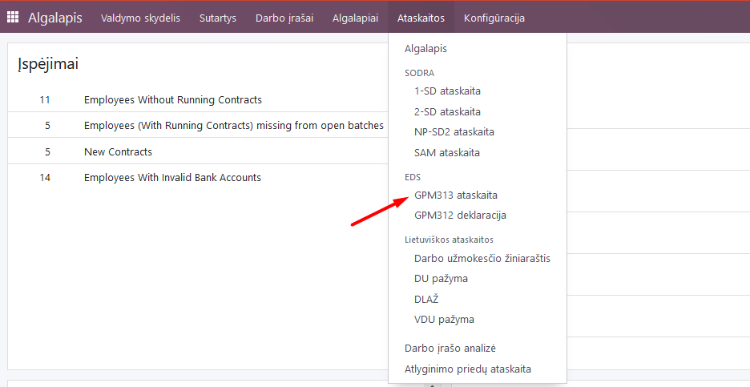
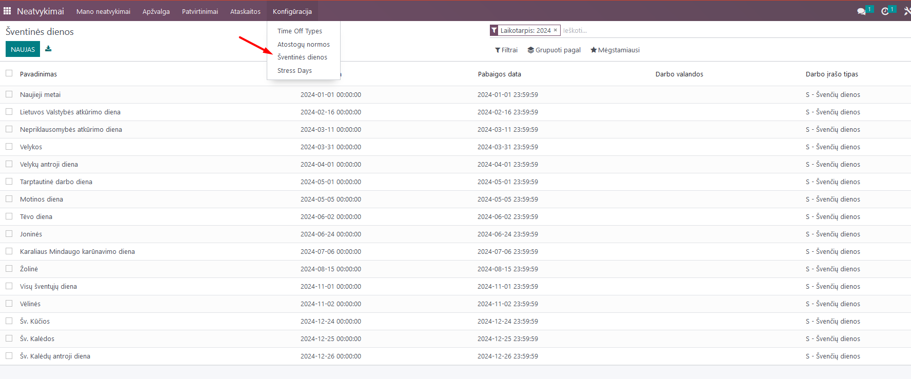

Payroll Calculation Instructions
===============================

1. Introduction
----------------
Payroll calculation includes employee contacts, input of employment contract information (module "Employees"), creation of work schedules, absence tracking (modules "Planning" and "Absences"), work time accounting, payroll calculation, and various forms for Sodra and VMI related to payroll (module "Payroll").

2. Installation and Configuration
---------------------------------

2.1. Configuration of Accounting Entries
~~~~~~~~~~~~~~~~~~~~~~~~~~~~~~~~~~~~~~~~
When using payroll calculation in Odoo, it is important to set up the accounting entries, based on which information will be sent to the Accounting module upon confirmation of calculations. If the same accounting entries will be used for all employees, it should be specified in the Payroll module, in the Configuration section, under "Rules".

.. image:: salary_calculation/image01.jpg
    :alt: Payroll Rules Configuration

Select "Monthly Payroll" and review all the lines in the opened list, assigning the appropriate accounting accounts where needed based on your company's chart of accounts.

.. image:: salary_calculation/image02.jpg
    :alt: Assign Accounts

You can assign the account by entering a specific line, in the "Accounting" tab.

You can also choose whether to show this line in the payroll form and, if needed, select an analytical account.
If you want to use different accounting accounts for different employees based on their departments, check the box "Use department accounts".

In this case, the accounting entries settings are done in the departments, which can be found in the Employees module, Configuration.

Create a department card and specify the payroll debit and credit accounts in it. Standard entries, such as GPM deductions from employees, remain common for all company employees.

**IMPORTANT:** If you use department accounting entries, the employee must be assigned to one of the existing departments in the employee card.

2.2. Entry of Monthly Working Hours, if Cumulative Working Time Accounting is Applied
~~~~~~~~~~~~~~~~~~~~~~~~~~~~~~~~~~~~~~~~~~~~~~~~~~~~~~~~~~~~~~~~~~~~~~~~~~~~~~~~~~~~~~
If at least one employee is subject to cumulative working time accounting, it is necessary to enter the number of working hours for the corresponding months before performing the first calculations. This is done in the Payroll module, Configuration, Cumulative Working Time section.

In the opened window, create new years and within them, by adding a line, enter the corresponding number of working hours for each month according to the calendar.

.. image:: salary_calculation/image09.jpg
    :alt: Working Hours for the Month

2.3. Configuration, if Advances are Paid to Employees
~~~~~~~~~~~~~~~~~~~~~~~~~~~~~~~~~~~~~~~~~~~~~~~~~~~~~
If the company pays advances to employees, the accounting accounts used for them are set in the Payroll module, Configuration, Settings section, by entering the corresponding accounting accounts. For advance payments, an interim account should be used, e.g., 273 (money in transit).

2.4. Configuration of Vacation Accruals
~~~~~~~~~~~~~~~~~~~~~~~~~~~~~~~~~~~~~~~
The settings for accrual accounts are entered in the Payroll module, Configuration, Settings section, specifying the appropriate accounting accounts according to your chart of accounts:

3. Main Functions
-----------------

3.1. Assignment of Executive Orders
~~~~~~~~~~~~~~~~~~~~~~~~~~~~~~~~~~~
If it is necessary to make deductions from the employee's salary according to executive orders, enter the data in the specific employee's card, in the "Executive Orders" section. Click "Add line" and enter the data. The recipient of the deduction should be described as a partner - in this case, there will be an option to directly form a payment to the bank. Select the deduction percentages. If there are several executive orders for the same employee, enter them all, distributing the percentages accordingly. The date defines from which date the employee's money will be deducted. In the debt section, enter the amount of debt according to the executive order.

3.2. Creation of Standard Work Schedules
~~~~~~~~~~~~~~~~~~~~~~~~~~~~~~~~~~~~~~~~
When creating an employment contract, the employee is assigned one of the two sources of work records - either a Work Schedule or the Planning module. Information about the creation of schedules in the Planning module can be found in the Shift Work Time Accounting Instructions. Standard, regular work schedules are described in the Payroll module, Configuration, in the "Work Times" section.

In this section, after describing the specific work schedule and assigning it in the employee card, by default, the working time data will be taken from the schedule (considering absences) when calculating payroll.
**IMPORTANT:** In the schedule, pay attention to the function of shortening the pre-holiday day, the function of ignoring holidays, and the working time proportion compared to full time - configure it according to your needs:

.. image:: salary_calculation/image14.jpg
    :alt: Work Schedule Configuration

In the schedule, specify the exact start and end times of work and the lunch break, as shown in the example. Odoo typically divides the working day into two parts: morning and afternoon.
**NOTE:** If, when creating a new employment contract, it turns out that there is no suitable work schedule - you can create it directly from the employee card, entering the name of the new schedule in the work schedule line and clicking the "Create and edit" link - you will be taken to the schedule creation window, just as when describing schedules in the Payroll module.

.. image:: salary_calculation/image15.jpg
    :alt: Create and Edit Work Schedule

3.3. Assigning Sodra Ceilings to the Employee
~~~~~~~~~~~~~~~~~~~~~~~~~~~~~~~~~~~~~~~~~~~~~
Upon receiving a notice from Sodra that a specific employee's salary has reached the Sodra ceiling level and, in the current year, a lower VSDFV contribution rate must be applied, this is indicated in the employee card, in the "Personnel Settings" section, by checking the box for "Reached Sodra Ceiling."

.. image:: salary_calculation/image16.jpg
    :alt: Sodra Ceilings

**NOTE:** After the end of the year and the calculation of the previous year's December salary, before calculating the first salary of the current year, it is necessary to remove this check mark in the card to restore the standard Sodra contribution rates for the employee.

4. Daily Scenarios and Calculation Process
------------------------------------------

4.1. Entering Absences
~~~~~~~~~~~~~~~~~~~~~~
Before performing payroll calculations, check if the absence data for the specific calculation month have been entered and approved by the manager in the Absences module: vacations, parental leave, sickness, etc. More information on how to do this can be found in the Absence Registration Instructions.

4.2. Checking for Duplicate Entries
~~~~~~~~~~~~~~~~~~~~~~~~~~~~~~~~~~~
Before calculating payroll, check for overlapping work entries, for example, if the employee has entered vacations and sickness for the same dates. Do this in the Payroll module, in Work Entries, selecting the "Conflicts" section and setting the appropriate month. If there are conflicts/inconsistencies, adjust the entries in the respective module accordingly.

.. image:: salary_calculation/image17.jpg
    :alt: Check for Conflicts

4.3. Review and Corrections of the Work Time Ledger
~~~~~~~~~~~~~~~~~~~~~~~~~~~~~~~~~~~~~~~~~~~~~~~~~~~
Before calculating salaries, review the work entries for the corresponding month. Data in this table come from work schedules, the Absences module, and the Planning module.

.. image:: salary_calculation/image18.jpg
    :alt: Work Time Ledger

Note that if the salary has already been calculated and approved for a specific employee, you will see a black corner in the work entries.

If it is necessary to enter deviations from the work schedule for a specific employee, such as night hours, overtime work, etc., this can be done on the specific day and the specific employee's work entry. If you are adding additional time, click "+" and enter the information in the opened window.

Select the type of entry and the time from when to when this mark is relevant. Save and confirm the information. An additional line or cell for additional entries will appear in the specific employee's work schedule.
If it is necessary not to add an additional entry but to change the existing one (e.g., to a business trip), go to the existing cell and inside it, change the type of entry and save the change.

**NOTE:** If, after making changes, you click the "Recreate Work Entries" button and select the employee or several employees affected by these manual changes - the changes will be canceled, and the initial information from the Absences module and the schedule will be reloaded.

4.4. Payroll Calculation
~~~~~~~~~~~~~~~~~~~~~~~~
After checking the work entries and entering all additional hours, perform the payroll calculation. You can do this from the work entries window by clicking the "Generate Payrolls" button.

In this case, payrolls for the respective month will be formed for the entire group of employees.
It is also possible to create a payroll for a specific employee. In the Payrolls section, select "All Payrolls" and click "New".

In any of the mentioned cases, draft payrolls for each employee will be created. In the payroll, you will see the gross salary, as well as vacation pay, sickness benefits, etc., if any, and additional payments for night hours, overtime, etc.

.. image:: salary_calculation/image25.jpg
    :alt: Payroll Details

To check all earnings and deductions, you can open the "Salary Calculation" tab in this draft and see all earnings and deductions and the amount to be paid.

4.5. Entering Additional Bonuses, Such as Per Diems, Bonuses, In-Kind Income, etc.
~~~~~~~~~~~~~~~~~~~~~~~~~~~~~~~~~~~~~~~~~~~~~~~~~~~~~~~~~~~~~~~~~~~~~~~~~~~~~~~~~
If it is necessary to enter bonuses or additional amounts payable to the employee, this can be done in the payroll calculation draft for the specific employee, in the "Other Earnings" section.

As the type, select the appropriate earning from the list. Based on this type, calculations and tax deductions will be performed, so it is important to choose the correct one. In the "Calculate" column, enter the required amount.
Below the other earnings section, you will also see the "Executive Order" section, where data will be automatically entered if executive orders or deductions are configured in the employee's card, as described above.

.. image:: salary_calculation/image28.jpg
    :alt: Executive Orders Section

After entering all additional bonuses, to recalculate the payroll including them, click the "Calculate Sheet" button.

.. image:: salary_calculation/image29.jpg
    :alt: Calculate Sheet

4.6. Approval of Payroll, Sending by Email, Forming Payments, Marking Payment, Controlling Overpayments
~~~~~~~~~~~~~~~~~~~~~~~~~~~~~~~~~~~~~~~~~~~~~~~~~~~~~~~~~~~~~~~~~~~~~~~~~~~~~~~~~~~~~~~~~~~~~~~~~~~~~~~
After recalculating the payroll, click the "Create Accounting Entry" button.

By clicking this button, you will send the payroll data to the Accounting module's general ledger. After creating the accounting entry, form an entry in the bank for payment.
Click "Create Payment Report", select the bank set in your accounting module where you will make the payment, and confirm. An attached file for sending payments to the bank will be created in the Accounting module.

.. image:: salary_calculation/image31.jpg
    :alt: Create Payment Report

.. image:: salary_calculation/image33.jpg
    :alt: Bank Payment Entry

After making the payment, it needs to be recorded for the specific payroll. As long as the payroll is not marked as paid, its status is "Done". To mark the payment, open the list of payrolls and mark the payrolls you want to change the status to "Paid".

.. image:: salary_calculation/image34.jpg
    :alt: Mark Payrolls as Paid

After marking the desired payroll (or several), click "Action" and select "Mark as Paid".

Enter the date of the payment and confirm.

.. image:: salary_calculation/image36.jpg
    :alt: Payment Date

If a partial payment was made, check the box "Is Partial Payment" and manually enter the paid amount in the opened table, then confirm.

.. image:: salary_calculation/image37.jpg
    :alt: Partial Payment

After performing these actions, depending on whether the payroll was fully or partially paid, its status will change in the payroll list.

.. image:: salary_calculation/image38.jpg
    :alt: Payroll Status

In the case of partial payments, or if there is an overpayment for the employee, you will see them when forming payments for the next month. In this case, when forming payments for the next month, you will be offered to adjust the payable amount by the amount of overpayment/underpayment.
**NOTE:** Data for GPM declarations are loaded based on payment dates, so it is important to perform this action and specify the correct payment date.
**NOTE:** If you notice an error, in the specific employee's payroll, click the "Cancel" button, then "Set to Draft" and you will be returned to the payroll calculation where you can adjust the information.

.. image:: salary_calculation/image39.jpg
    :alt: Cancel Payroll
.. image:: salary_calculation/image40.jpg
    :alt: Set to Draft

To send payrolls (salary slips) to employees, open the payroll list, mark which payrolls you want to send, select "Action" and choose "Send Payroll" - the selected payrolls will be sent to the respective employees to the email addresses specified in their cards.

**NOTE:** Changing the status of payrolls and recalculating them can be done not only one by one but also for all selected at once. For this purpose, in the Employee Payrolls list, mark the relevant entries, choose "Action" and click on the required function.
Payroll can be calculated not only for a specific person but also for a group of employees. In this case, the calculation is performed from the "Work Entries" window. After entering all the necessary changes in the employees' working time, click the "Generate Payrolls" button.

.. image:: salary_calculation/image42.jpg
    :alt: Generate Payrolls for Group

In Payrolls/All Payrolls, you will find an entry where a group of payrolls for all employees has been created. In parentheses, you will see how many payrolls have been created.

To review the created payrolls and enter additional earnings, open the group and expand the list of all payrolls. You can make changes by entering the specific employee's payroll and clicking "Calculate Sheet" after making changes.

.. image:: salary_calculation/image44.jpg
    :alt: Expand List of Payrolls

When you have made all the necessary changes, in the opened list in a specific group, mark all the payrolls in it and select "Create Accounting Entry" in the Action menu. Similarly, perform the actions "Send Payroll" and "Mark as Paid".

**IMPORTANT:** Despite being able to perform these actions by entering the payroll itself, for the entries to be created, it is necessary to do this in the group by marking all entries together and selecting the corresponding action in the "Action" button, not individually.

4.8. Entering Advances
~~~~~~~~~~~~~~~~~~~~~~
When paying an advance to an employee, the entry is made in the Payroll module, Payrolls, Advances.

.. image:: salary_calculation/image47.jpg
    :alt: Advances

Create "New", select the employee, the bank where you will create the file, the dates, and the advance amount. Click "Create SEPA File".

4.9. Printing the Work Time Ledger, Payroll Ledger
~~~~~~~~~~~~~~~~~~~~~~~~~~~~~~~~~~~~~~~~~~~~~~~~~~
After calculating the payroll, print the Work Time Ledger:
In the Payroll module, Reports, Work Time Ledger (DLAŽ).

.. image:: salary_calculation/image49.jpg
    :alt: Work Time Ledger

In the opened table, select the year, month, if you want to print separately for a specific employee or department - select them as well. If not selected, it will be printed for all employees. Also, select the person who created the DLAŽ and the responsible person. Click the "Print PDF" button.

.. image:: salary_calculation/image50.jpg
    :alt: Print PDF

A .pdf file will be downloaded and saved to your computer for printing.

To print the Payroll Ledger:
In the Payroll module, Reports, select "Payroll Ledger".

.. image:: salary_calculation/image52.jpg
    :alt: Payroll Ledger

In the opened table, fill in the dates. If you want to print a separate payroll ledger for the department, select the department. If you do not use departments or want to form a ledger for all employees - leave this field empty. Click the "Print PDF" button, and the ledger will be saved to your computer.

You can also choose the ledger in .xls format.

4.10. Formation and Printing of Payroll Certificates
~~~~~~~~~~~~~~~~~~~~~~~~~~~~~~~~~~~~~~~~~~~~~~~~~~~~
To form a payroll certificate, in the Payroll module, Reports, select the "Payroll Certificate" section.

In the opened card, select the specific employee and dates for which the certificate is needed. Click "Print PDF", and a standard certificate will be sent to your computer.

4.11. Formation and Printing of Average Salary Certificates
~~~~~~~~~~~~~~~~~~~~~~~~~~~~~~~~~~~~~~~~~~~~~~~~~~~~~~~~~~~
To print an average salary (VDU) certificate for an employee, in the Payroll module, Reports, select the VDU certificate, in the opened table, specify the employee, the date for which the certificate is needed, and the preparer of the certificate, click "Print PDF".

.. image:: salary_calculation/image57.jpg
    :alt: VDU Certificate
.. image:: salary_calculation/image58.jpg
    :alt: Fill VDU Certificate

A .pdf file with the data for the last 3 months up to the specified date will be created and automatically saved on your computer.

4.12. VSDFV Reports:
~~~~~~~~~~~~~~~~~~~~

4.12.1. 1-SD Report
~~~~~~~~~~~~~~~~~~~
This form is created when hiring an employee. After entering the employee's data in the "Employees" module and creating an employment contract, go to the "Payroll" module, Reports, Sodra, 1-SD report.

In the opened table, select the employment contract number of the employee for whom the 1-SD notification is created. Click "Generate Declaration File".

.. image:: salary_calculation/image61.jpg
    :alt: Generate 1-SD File

A file that can be uploaded to the Sodra system will be automatically saved on your computer.

4.12.2. 2-SD Report
~~~~~~~~~~~~~~~~~~~
This form is created when dismissing an employee. After entering the employee's data in the "Employees" module and creating a dismissal entry, go to the "Payroll" module, Reports, Sodra, 2-SD report.

In the opened table, select the employment contract number of the employee for whom the 2-SD notification is created. Click "Generate Declaration File".

.. image:: salary_calculation/image63.jpg
    :alt: Generate 2-SD File

A file that can be uploaded to the Sodra system will be automatically saved on your computer.

4.12.3. NP-SD Report and Calculation of Sick Pay by the Company
~~~~~~~~~~~~~~~~~~~~~~~~~~~~~~~~~~~~~~~~~~~~~~~~~~~~~~~~~~~~~~~
We suggest filling out this declaration directly in the Sodra system by entering the sick pay amount calculated by the employer in the program. In the Absences module, create a sick leave entry by selecting the appropriate type of absence and dates, and approve it.

After confirming the sick leave entry, select "VDU Certificate" in the printing link.

.. image:: salary_calculation/image65.jpg
    :alt: VDU Certificate for Sick Leave

A special VDU certificate will be formed, showing the sick pay amount depending on the work schedule for the first 2 working days if they coincided with the employee's work schedule. Enter this amount in the Sodra NP-SD notification.

.. image:: salary_calculation/image66.jpg
    :alt: Enter Sick Pay Amount

You can also generate the NP-SD notification directly from Odoo, but this is not very convenient because the sick leave certificate numbers will not be included, and you will have to enter them manually from the Sodra system.

4.12.4. Monthly SAM Report
~~~~~~~~~~~~~~~~~~~~~~~~~~
This form is used to declare monthly information about employee income and contributions paid to Sodra. After performing the monthly calculations and confirming the payrolls, in the Payroll module, select Reports, Sodra, SAM report.

.. image:: salary_calculation/image67.jpg
    :alt: SAM Report

In the opened table, select the year and month for which the report is being generated. Click "Generate Declaration File".

.. image:: salary_calculation/image68.jpg
    :alt: Generate SAM File

A file that can be uploaded to the Sodra system will be automatically saved on your computer.

4.13. VMI Reports:
~~~~~~~~~~~~~~~~~~

4.13.1. GPM 313 Declaration
~~~~~~~~~~~~~~~~~~~~~~~~~~~
The monthly GPM declaration can be found in the Payroll module, Reports, in the EDS section, GPM313 declaration.

After selecting it, specify the year and month and click the "Generate Declaration File" button.

A file will be created and automatically saved on your computer for upload to the VMI EDS system in ffdata format. To review the data before uploading the file to the system, use ABBYY eFormFiller software.

4.13.2. GPM 312 Declaration
~~~~~~~~~~~~~~~~~~~~~~~~~~~
The annual GPM declaration can be found in the Payroll module, Reports, in the EDS section, GPM312 declaration.

After selecting it, specify the year and click the "Generate Declaration File" button.

.. image:: salary_calculation/image72.jpg
    :alt: Generate GPM 312 File

A file will be created and automatically saved on your computer for upload to the VMI EDS system in ffdata format. To review the data before uploading the file to the system, use ABBYY eFormFiller software.
**NOTE:** When using the Via Laurea Payroll Calculation module, there is an option to include amounts paid to individuals when forming the annual GPM312 declaration. To use this option, when describing an individual contact in the Contacts module, mark it as an individual supplier, select the appropriate point as the license type (Personal Code, IDV number, etc.), and enter the specific number as the IDV number.

.. image:: salary_calculation/image73.jpg
    :alt: Enter IDV Number

When entering this supplier's invoice, in the L5 note for GPM312, select the appropriate activity code from the list.

After performing these actions, when forming the GPM312 declaration for the respective period, the amounts paid to individuals will be included in the declaration.

5. Use of the Absences Module for Lithuanian Accounting
-------------------------------------------------------
The Absences module is closely related to the Payroll module. When information is entered into the Absences module, it affects payroll calculations. The standard Odoo Absences module instruction can be found on our website. Due to the specifics of payroll calculation in Lithuania, we have supplemented the Absences module with certain functions.

5.1.1. Configuration of the Absences Module
~~~~~~~~~~~~~~~~~~~~~~~~~~~~~~~~~~~~~~~~~~~
In the Absences, Configuration section, "Time off types", you will find a list of all possible absences and markings:

.. image:: salary_calculation/image75.jpg
    :alt: Time Off Types

If necessary, you can adjust the list, but note that this is related to payroll formulas. In the "Approval" column, you can see which types of absence require manager approval. To mark a specific type of absence as requiring approval, go to the line entry and check the box for requiring approval.

**NOTE:** After entering the absence information and, if necessary, approving it by the responsible person, the absence information along with the absence type marking symbols will be automatically uploaded to the work entries for the specific period.

5.1.2. Entering Vacation Norms
~~~~~~~~~~~~~~~~~~~~~~~~~~~~~~
In the Absences, Configuration section, "Vacation Norms", enter the vacation day norms used in your company (20 working days per year by default, 25 working days for single parents raising a child up to 12 years old, etc., according to the laws).

5.1.3. Entering Holidays
~~~~~~~~~~~~~~~~~~~~~~~~
In the Absences, Configuration section, "Holidays", enter the holidays for the current year.

5.2. Assigning Vacations to the Employee
~~~~~~~~~~~~~~~~~~~~~~~~~~~~~~~~~~~~~~~~
When hiring an employee, a set annual vacation norm must be assigned to them. Odoo has the ability to calculate vacations only from the next day. For this reason, when hiring an employee, it is necessary to make 2 entries. The first one is for "accrued vacations" for the first working day, and the second is for standard vacation accrual from the next day.
Enter vacation assignments in the Absences, Approvals, Assignments section.

When hiring an employee, create a new assignment:

In it, select the type as "Regular Assignment", specify the specific employee in the Employee field, and in the "Duration" field, enter the amount of vacation entitled for the first working day. Approve the entry.
The second assignment is for vacation accrual:

Fill in the assignment similarly, only select "Accrued Assignment" as the type and select the applicable vacation norm for that employee from the list in the Vacation Norms field. After doing this, approve the entry.
If already working employees are uploaded to the Odoo system with already accrued vacations (e.g., previously using other software for payroll), it is also necessary to make 2 entries, as in the hiring case. In this case, in the first entry, enter the already accrued vacations up to this day, following the description of the first working day entry. In the second entry, assign the accrual based on the applicable vacation norm for the employee.
**NOTE:** If you forgot to enter vacation accrual entries when hiring an employee, calculate how many vacations the employee has accrued until this day, and enter the obtained number when entering the regular vacation assignment for the first working day.

5.3. Entering Absences
~~~~~~~~~~~~~~~~~~~~~~
When entering employee absences, follow the standard Odoo Absences module instruction - in the Absences, Approvals, Absences section, create a new entry, select the appropriate employee, type of absence, fill in the dates, and approve the entry. After doing this, the information will be automatically transferred to the Payroll module.

5.4. Reports and Vacation Accruals
~~~~~~~~~~~~~~~~~~~~~~~~~~~~~~~~~~
In the Absences module, in Reports, you can find standard reports by employee and type of absence, the formation of which is described in the standard Odoo Absences module description.
Additionally, you can see the Vacation Accrual report, which you can generate in pdf format for the specified date.

If the accounting entries described above are configured in the Payroll module, clicking the "Create Entry" button in the report formation window will create an accrual entry in the Accounting module.

6. Integrations and Connections with Other Modules
---------------------------------------------------
This module interacts with the Accounting, Employees, Absences, and Planning modules.
