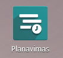
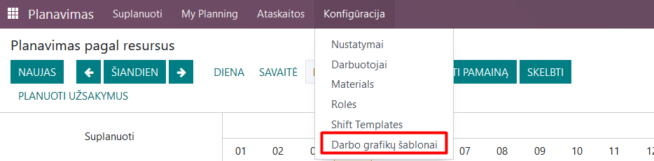
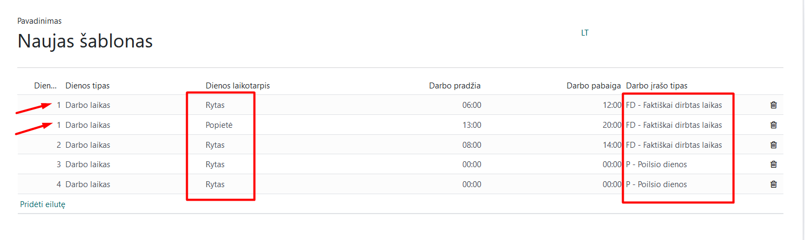
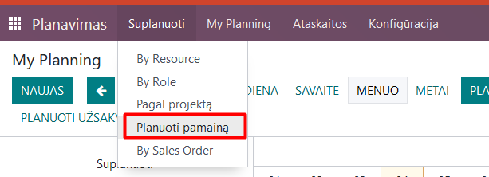
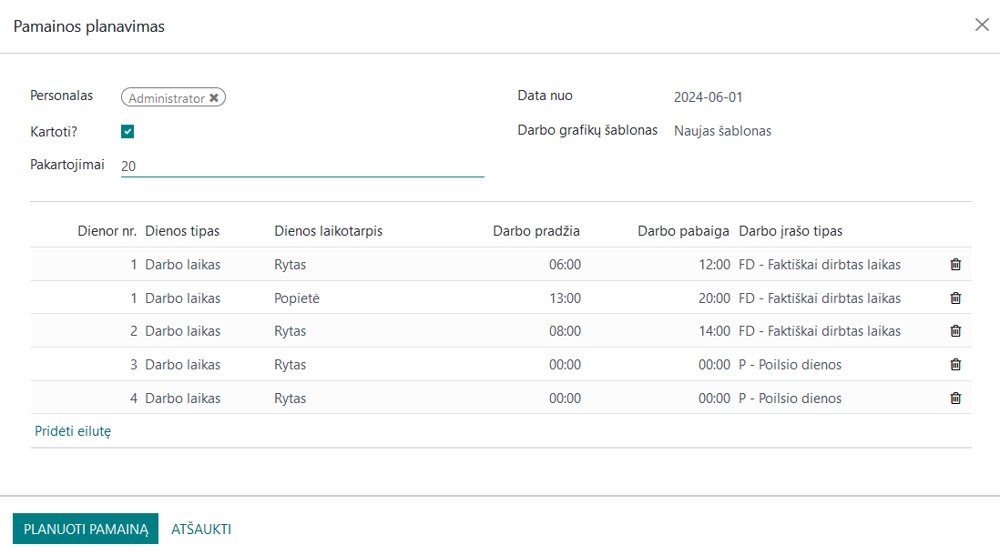
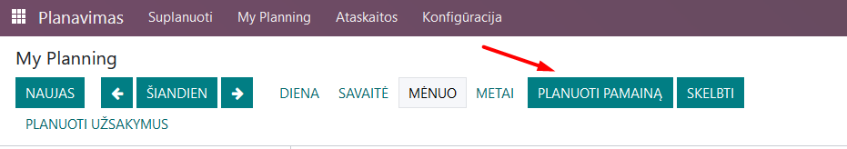
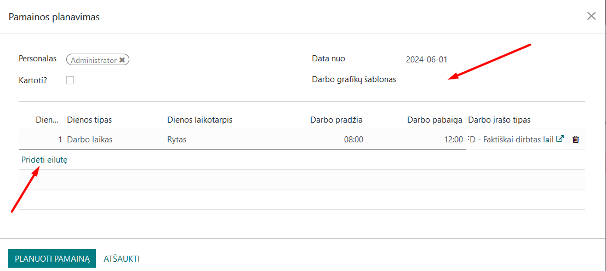
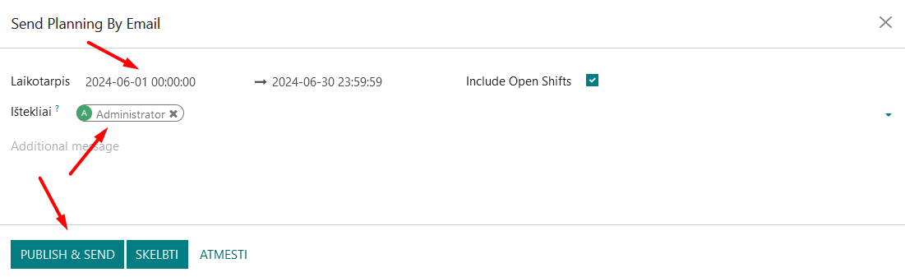

Shift work scheduling
=====================

Introduction
------------

UAB Via Laurea has developed a plugin for the standard Planning module, enabling a broader application of this module for Lithuanian work time accounting needs.
The Planning module is intended for creating work schedules and shifts, accurately determining work hours when the work time is irregular or cumulative work time accounting is applied. The following module is used for planning:

Usage and Main Scenarios
------------------------

In the Planning module, you can create shift templates and individual schedules for a specific selected employee.

Creating a Template:
In the Planning module, in the configuration section, select "Work Schedule Templates":

In the opened window, create shifts according to your needs and save. Note that an Odoo day is divided into morning and afternoon parts, allowing you to define lunch break time. For this reason, two lines are entered for the same day, as shown in the example. If the employee works without a lunch break, you can choose only one part, but it is necessary to select one. In the work time accounting sheets, morning or afternoon is not reflected; it is only used in schedule creation.
Important: if working in a rotating schedule (e.g., 2 days on and 2 days off) - describe the off days in the schedule template. In this case, when assigning a schedule to an employee, you can choose the number of repetitions, allowing you to automatically create future schedules.

To assign a schedule to a specific employee, there are two options:
1. You can select Schedule/Plan Shift:

In the opened window, select the employee, start date, desired work schedule template, and, if necessary, check the Repeat box and choose the number of periods. After entering all the necessary information, click "Plan Shift."

A similar planning window can also be accessed using the "Plan Shift" button:

If it is not practical to create shift schedules according to your needs, planning for a specific employee can be done directly in the opened shift window by entering the appropriate information for the specific employee. In this case, do not choose a work schedule template but enter an individual schedule by adding lines. After finishing the planning, click "Plan Shift."

After finishing the shift planning, choose the "Publish" button, select the employees and period in the opened window, enabling you to send the employee their schedule via email and send data to the Payroll module.

When the "Publish" button is selected, the schedule is not sent via email, but the data is sent to the Payroll module.

Integrations and Connections with Other Modules
-----------------------------------------------

This Odoo module is connected with the "Employees" and "Payroll" modules.
